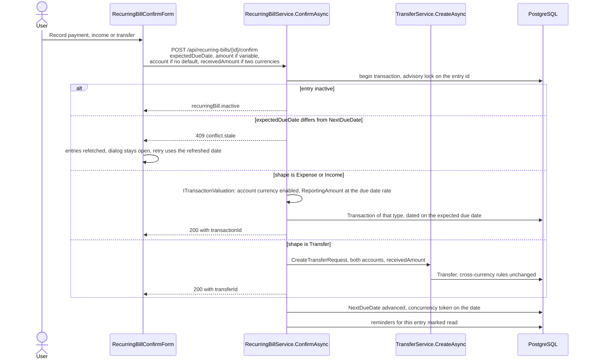
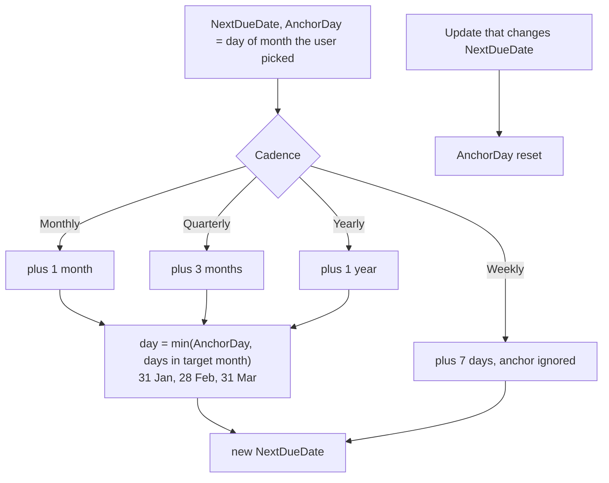
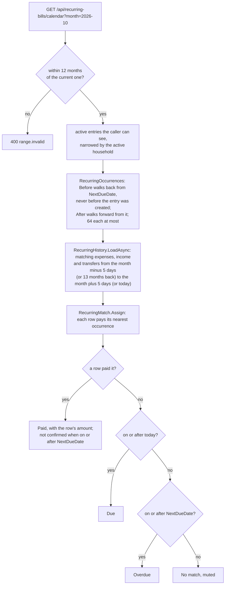
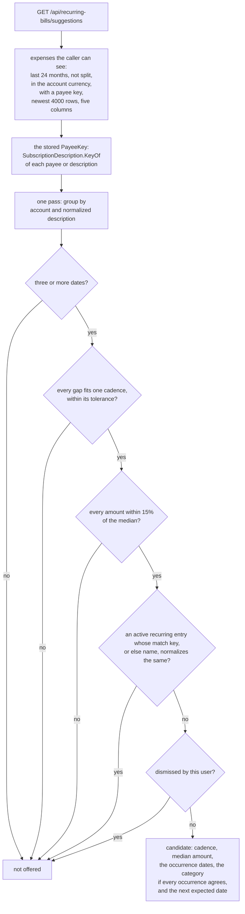
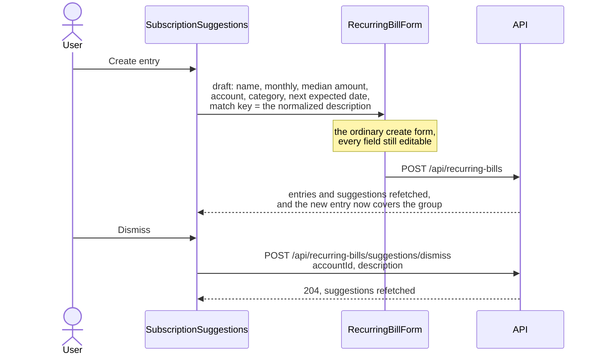

# Recurring entries

Back to the [feature walkthrough](README.md). See also [decisions](../decisions/recurring-bills.md), [architecture: Background work and notifications](../architecture/background-jobs.md).

Backend `RecurringBills`, page `/recurring-bills`. A recurring entry is a schedule, not a posting: nothing reaches the ledger until somebody confirms an occurrence.

The page opens on its List view, described here; the [Calendar](#calendar) view shows one month as a grid. The list shows active entries under three headings by next due date against today in the installation time zone: Overdue (before today), Due this week (today and the six days after) and Later. Each heading is shown only when it has entries, and each keeps the API's due-date order. Inactive entries sit in a closed "Inactive (n)" disclosure below. An active entry that is overdue or due within the week adds a relative day after its date, such as "(tomorrow)" or "(3 days ago)", formatted by `Intl.RelativeTimeFormat` in the interface language. The grouping is `groupBills` in `features/recurring-bills/bill-groups.ts`, and the row reads the same `urgencyOf` to decide on the "Overdue" tag and the relative day. The page looks up account and category names in maps built once per render, not per row. `bill-row-layout.tsx` holds the row grid for entries and suggestions and the `BillRowsSkeleton` the pending page draws with the same classes.

Two properties describe an entry. Its **shape** says what a confirmation writes — an expense, an income, or a transfer between two of your own accounts — and its **kind** says whether the amount is always the same (fixed, carried on the entry) or changes each time (variable, typed at confirmation). Every combination is allowed, so a variable transfer is as ordinary as a fixed expense.

The user-facing name is "recurring entries" in both locales, because "bills" stopped covering two of the three shapes. The table, the entity, the service and the route prefix are still `RecurringBill` and `/api/recurring-bills`: a rename would mean a migration plus a backup format that no file taken by an older version could be restored into, since a backup names the tables it carries. The names are documented as a deliberate mismatch rather than paid for.

A recurring entry can be shared with a household when its accounts and category, and the debt it pays, are shared with it; members see and confirm it, and the reminder goes to its owner. Any entry that pays a shared debt, personal or shared, must use an account shared with the debt's household. See [Households and sharing](households-and-sharing.md#shared-budgets-goals-and-recurring-entries).

## What each shape needs

| Shape | Account | Second account | Category |
| --- | --- | --- | --- |
| Expense | Optional default, asked for at confirmation when empty | Rejected | Optional expense category |
| Income | Optional default, asked for at confirmation when empty | Rejected | Optional income category |
| Transfer | Required, the account the money leaves | Required, the account the money arrives in, and different | Rejected |

The same rules run on create and on update, so a shape change that would leave a required field empty is refused with the field at fault and a published code (`required`, `transfer.sameAccount`, `value.mustBeEmpty`). The form follows the choice: picking Transfer swaps the category select for the destination account, picking Expense or Income swaps it back.

Since 2026-09-30 an expense or income entry can carry `spreadMonths`, 2 to 36 (`range.invalid` outside that, `value.mustBeEmpty` on a transfer), and every confirmation copies it onto the transaction it writes, so yearly insurance set up once as a yearly entry counts a twelfth in each month of reports and budgets; see [Spreading over months](transactions.md#spreading-over-months). The form has the same "Spread over" select as the transaction form on the expense and income shapes and hides it for a transfer. Since 2026-10-02 an entry also carries `spreadDirection`, and its form the same "Months counted" select, so a quarterly bill paid in arrears writes transactions that count in the three months up to their date.

## Confirming an occurrence

The transfer branch calls the ordinary transfer create path instead of writing a second one. That path resolves the two account currencies, demands `receivedAmount` when they differ (`transfer.receivedAmountRequired`), refuses a mismatched pair in one currency and checks that both currencies are enabled — behaviour a copy inside this service would have had to repeat and would have drifted from. Because both services share the request-scoped `AppDbContext`, the transfer is written inside the same database transaction and under the same advisory lock as the schedule advance.

An entry has no currency of its own. Its amount, and the amount typed for a variable entry, is in the currency of the account that pays or receives it, which is the entry's account or the one chosen at confirmation. An expense or income occurrence is valued by `ITransactionValuation`, the same path the transaction form, the import and the conversion fee take: a disabled currency answers `currency.disabled`, and `ReportingAmount` is converted at the rate for the due date.

The confirm dialog names what it will create, per shape and per kind, and shows the "amount received" field only when the two accounts hold different currencies.

What lands in the ledger is an ordinary row, so nothing downstream needs to know it came from a schedule, with one exception: an expense entry can name a debt that tracks its payments (`debtId`, refused on the other shapes with `recurringBill.debtShape`, for a debt the caller cannot see with `reference.notFound`, for a shared debt paid from an account not shared with its household with `household.referenceNotShared` and for a debt that does not track payments with `debt.notTracked`; while Net worth is switched off the link is kept but not checked, and confirming writes no payment), and confirming it links the posted row to that debt as a regular payment inside the same database transaction and lock, which lowers the debt's tracked balance (see [Debt amortization](debt-amortization.md#tracking-payments)). The form offers "Pays debt" on the expense shape, listing the caller's debts that track payments. The `/recurring-bills` loader warms the debts while Net worth is on, and the form clears a linked debt it cannot list only after the debts have loaded, so saving an edit made while they are still loading keeps the link. Purging the debt clears the field, and restoring an entry from the trash whose debt is gone clears it instead of refusing. Otherwise: a confirmed income counts as income in reports, on the dashboard and against no budget; a confirmed expense counts against the budget of its category; a confirmed transfer moves both balances and counts as neither.

## Marking an occurrence done

Since 2026-10-01 an occurrence can be marked done without recording it again: when a bank import already brought the payment in, or when the occurrence was skipped on purpose. `POST /api/recurring-bills/{id}/skip` takes `expectedDueDate` and an optional `transactionId`, and answers the entry with its new next due date. It writes no transaction and no transfer.

It runs the confirmation's checks in the same order under the same advisory lock (`LockDueAsync`): an entry the caller cannot see answers 404, an inactive one `recurringBill.inactive`, and a date that is not the next due date 409 `conflict.stale`, so a double click, or a confirm and a mark racing each other, move the schedule once. It then advances the schedule and marks the entry's unread reminders read through the same `AdvanceAsync` as a confirmation. A member of the household a shared entry belongs to may mark it done, as they may confirm it.

When the entry pays a debt that tracks payments and `transactionId` names the row that paid the occurrence, that row is linked to the debt as a regular payment inside the same transaction, as a confirmation links the row it writes, with the same conditions (Net worth on, and for a shared debt an account shared with its household). The row must be an expense the caller can see, not split and not a refund, and must not pay a debt already, in the trash or not; otherwise nothing is linked and the mark still succeeds.

The page offers it in two places, both through `useSkipRecurringBill` on `RecurringBillsPage`, with the toast "Marked as done. The entry moved to its next date." and no confirmation dialog, since editing the next due date undoes it:

- On the [calendar](#clicking-a-chip), a paid chip that is not confirmed and sits on the entry's next due date shows **Mark as done**, which sends the chip's date and its row.
- On the list, an active entry that is overdue or due this week gains **Mark as done** in its row actions, which then fold into the actions menu; it sends the next due date and no row.

The route is not on the [API token](personal-api-tokens.md#writing-with-a-token) write list. Its cache rule is the confirmation's in `invalidation.ts`.

## What the entries cost

Since 2026-10-01 the List view opens, above the forecast, with four figures in the reporting currency: **Costs per month** and **Costs per year** of the active expense entries, and **Income per month** and **Income per year** of the active income entries. Transfers move money between your own accounts and count in none of them. The figures are shown while at least one active expense or income entry exists, through the shared `SummaryStats`, so hiding amounts masks them like every other figure.

`GET /api/recurring-bills/totals` (`GetRecurringTotals`, `RecurringBillService.GetTotalsAsync`) computes them on the server, because the paid matching and the variable estimates need bank rows the client does not hold. It reads the entries the caller can see through the ordinary query filters, so the active household narrows it as it narrows the list, and it is readable with a personal API token like the rest of the prefix. Nothing is stored.

- **Cadence.** `RecurringCost.PerYear` counts a weekly entry 52 times a year, a monthly one 12, a quarterly one 4 and a yearly one once. The month figure is the year figure divided by 12, so a weekly €10 costs €520.00 a year and €43.33 a month. Sums are rounded once, at the end.
- **Amount.** A fixed entry counts at its amount in its account's currency; a variable one at the calendar's estimate, `RecurringEstimate`: the median of its newest six matching rows of the last 13 months.
- **Conversion.** Amounts are converted at the newest exchange rate, as on the calendar. An amount whose currency has no fresh rate is left out, and like an estimate inside a figure it adds the note "Partly estimated". An entry without an account, or a variable one with no matching rows yet, has no amount and is counted in a note such as "1 entry without an amount". The note is the calendar's, from one `estimateNote` helper.

### Possibly cancelled

The same answer lists `possiblyCancelled`: the active expense entries whose last two past occurrences no ledger row paid. The occurrences and the paid matching are the calendar's (`RecurringOccurrences`, `RecurringHistory`, `RecurringMatch.Assign`), walked over the last 25 months so a yearly entry has two cycles to look at, and an occurrence counts as past only once its matching window has closed: 5 days after the date, 2 for a weekly entry. `RecurringLapse.PossiblyCancelled` is the whole rule. Walking back never passes the entry's creation date, so an entry set up today is not marked for the cycles before it existed.

The row shows a neutral "Possibly cancelled" tag beside its name, whose tooltip and screen-reader text say "No payment matched its last two due dates. Switch the entry off if you cancelled it." There is nothing to dismiss: the mark clears itself as soon as a row pays one of the last two occurrences, and switching the entry off, which is what a cancelled subscription needs, removes it from the list's active groups. A confirmed occurrence writes a row under the entry's name, which matches, so an entry kept by confirming never lapses. Income entries are not marked: a missing salary is not a cancelled subscription. A possibly cancelled entry still counts in the totals while it is active.

The page reads the totals with the entries, and the route loader warms them. `invalidation.ts` refreshes `getRecurringTotalsQueryKey` after the transaction, import, conversion and broker rules, which can add or remove a paying row, and after an exchange rate sync; the recurring-entry rules already reach it under `/api/recurring-bills`.

Tests: `RecurringCostTests` for each cadence and the twelfth of a year; `RecurringLapseTests` for two missed occurrences, a row on either of the last two, only the last two counting, one missed occurrence, an open matching window, a future occurrence and a weekly entry; `RecurringTotalsTests` (integration) for the four cadences with income apart and a transfer left out, a variable estimate, a currency without a rate and entries without an amount, an inactive entry, the mark appearing and clearing when a payment matches while an income and a new entry stay unmarked, a household entry for the partner and under the active household, and `feature.disabled`; the `RecurringTotals`, `RecurringBillRow` (`PossiblyCancelled`) and `RecurringBillsPage` (`TotalsAndPossiblyCancelled`) stories; and the totals rule in `invalidation.test.ts`.

## Schedule advance

## Calendar

Since 2026-09-30 the page header has a **List | Calendar** switch. List is the page described above. Calendar shows one month as a grid of weeks that start on the installation's first day of the week, with Today, Previous and Next beside the month's name; Previous and Next stop 12 months either side of the current month. The view and the month live in the address (`/recurring-bills?view=calendar&month=2026-10`, the month left out for the current one), so the back button and a bookmark keep them. In Calendar view the cash-flow forecast, the entry groups and the inactive disclosure give way to the calendar, while **Add recurring entry**, the subscription suggestions and every dialog stay. The route loader warms the forecast only for the list and the calendar's month only for the calendar.

Backend `RecurringBills` (`GetBillsCalendar`, `RecurringBillService.GetCalendarAsync`) with the helpers it shares with the [cash-flow forecast](cash-flow-forecast.md) in `Common/RecurringBills/`; frontend `recurring-bills/bills-calendar` and `recurring-bills/bill-chip`, with `monthWeeks` in `lib/calendar.ts`. One read-only route, `GET /api/recurring-bills/calendar?month=YYYY-MM`, under the same switch and readable with a personal API token. Nothing is stored.

### The four states

- **Due**: on or after today and not paid.
- **Overdue**: before today and on or after the entry's next due date, so it has not been confirmed. Every such occurrence is overdue, as in the forecast; only the one on the next due date carries `isNextDue`.
- **Paid**: a ledger row paid it, and the chip shows that row's amount in its own currency. When the occurrence is on or after the next due date the entry itself still waits for the confirmation, and the chip adds "Not confirmed"; on the next due date it also offers [Mark as done](#marking-an-occurrence-done).
- **No match**: before today and before the next due date, so it was confirmed or skipped, but no row matched. It is drawn muted rather than as missed, because bank-text matching can miss a row whose text changed.

A past month shows only what an entry was expected to do after it was created: walking back stops at the creation date in the installation time zone, so an entry set up today shows nothing in last year's months.

### Which row pays an occurrence

The rows are the ones the forecast reads, from `RecurringHistory.LoadAsync`: non-split expenses and income with a positive amount whose stored `PayeeKey` equals one of the entries' keys, and transfers with a description, normalized the same way. A row pays an occurrence of an entry of the same shape when its key is one of the entry's two keys (`PriceRiseMatcher.KeysOf`: the normalized match key or name, and the normalized name), it is on the entry's account when the entry has one (and a transfer arrives in the entry's destination), and it is dated within 5 days of the occurrence, 2 for a weekly entry. That is the forecast's paid-but-not-confirmed tolerance, so the two views agree on what counts as paid. Each row pays at most one occurrence: the nearest by date, ties going to the lower entry id. When two rows reach the same occurrence the nearer one pays it and the other pays nothing. `RecurringMatch.Assign` is the whole rule and has its own unit tests.

### Amounts and totals

An occurrence that is not paid carries the entry's amount in its account's currency, or for a variable entry the median of its newest six matching rows of the last 13 months in the account's currency, marked estimated and shown as "≈ €41.20". An entry without an account has no currency, so its chips show "No amount". A household entry whose account the caller can no longer see shows "No amount" and "Account not visible", as the forecast leaves it out with that reason.

Above the grid three figures sum the month in the reporting currency: **Expected out**, every expense occurrence at its expected amount; **Expected in**, every income occurrence; and **Paid out**, the `ReportingAmount` of the rows that paid an expense occurrence. Expected amounts are converted with the newest exchange rate (`IExchangeRateService.GetLatestAsync`); a missing or stale rate leaves that amount out and, like a variable estimate inside a figure, adds the note "Partly estimated". Expense and income entries without an amount are counted in a note such as "2 entries without an amount". Transfers move money between your own accounts and count in none of the figures, although their chips show their amount.

### The grid and the phone

The body is a `<table>` with the month as its caption, a header row of weekday names from `Intl` (short, with the long name as `abbr`) and one row per week from `monthWeeks(month, weekStartsOn)`, including the days of the neighbouring months, which stay empty. Today's number is filled in navy and carries `aria-current="date"`. Each day lists its occurrences as chips: a shape mark (an arrow out for an expense, in for an income, both ways for a transfer, named for screen readers), the name, the amount, a tag for Overdue, Paid or No match, and the "Not confirmed" or "Account not visible" note. Income amounts carry "+" in the income colour. There are no page hotkeys; the month buttons are two Tab stops away.

On a phone the same month is an agenda: only the days that have occurrences, one per row, with the same chips. Both bodies are rendered and the breakpoint picks one (`hidden md:table` and `md:hidden`), since there is no breakpoint hook and effects are not allowed; story `play` functions query inside the table.

### Clicking a chip

- The occurrence on the next due date, due or overdue, opens the ordinary confirm dialog for that entry.
- Any other chip that is not paid opens the entry's edit form, through the page's `useEditableList`.
- A paid chip's name is a `TransactionsLink` to the ledger filtered to that account and that day.
- A paid chip that is not confirmed and is on the next due date adds a **Mark as done** link, named for screen readers with the entry, which advances the entry without a second row and links its row to the entry's debt when it pays one (see [Marking an occurrence done](#marking-an-occurrence-done)).

The chip finds its entry in the entries the page already loaded, by `billId`.

### Cache

The query key starts with `/api/recurring-bills/calendar`, under `/api/recurring-bills`. `invalidation.ts` also lists `getBillsCalendarQueryKey` by name in the recurring-entry rules and in the transaction, transfer, conversion, import and broker rules, because a new ledger row can pay an occurrence and those rules did not reach `/api/recurring-bills` before.

### No calendar subscription

There is no iCal (`webcal://`) feed. Calendar apps cannot send an `Authorization` header, and a token in the query string was rejected on 2026-09-29 because query strings end up in logs; a feed needs its own decision about a secret address. Reminders already reach email and Discord.

### Tests

- `RecurringOccurrencesTests`: `After` and `Before` for each cadence with month-end and leap-day anchors, a range across the next due date, no date before creation, and the cap of 64.
- `RecurringMatchTests`: the 5 and 2 day tolerances, another account or text, the nearest occurrence, a tie between two entries going to the lower id, two rows for one occurrence, and an entry without an account.
- `BillsCalendarTests` (integration): a monthly entry once and a weekly one every week, a variable estimate, an overdue occurrence paid by a bank row and left unconfirmed, a past occurrence with no row and a confirmed one, nothing before creation, inactive entries left out, a foreign currency without a rate, an entry without an account, transfers outside the totals, a household entry for the partner and under the active household, an account the partner cannot see, `month.invalid`, `range.invalid` 13 months away and `feature.disabled`.
- `calendar.test.ts` for `monthWeeks`, `invalidation.test.ts` for the calendar key, and the stories of `BillsCalendar`, `BillChip` and the Upcoming bills card.
- `SkipRecurringBillTests` (integration): marking done advances without a row, a wrong date, a second concurrent mark and a later confirm answer `conflict.stale`, an inactive entry is refused, the reminders are read, a household member marks a shared entry done, and the matched row pays the entry's debt once. The `BillChip`, `BillsCalendar`, `RecurringBillRow` and `RecurringBillsPage` stories click Mark as done and check the request body.

## Finding a subscription

Since 2026-09-21 the page also offers entries it found by itself. `GET /api/recurring-bills/suggestions` is a read-only analysis of the ledger: it writes nothing, it is behind the same `RecurringBills` switch as the rest of the route prefix, and it reads through `db.Transactions`, so account visibility and the active household narrow it exactly as they narrow the ledger.

### The numbers, and why they are those numbers

Every threshold is a named constant in `Common/Subscriptions/SubscriptionDetection.cs`; none of them is written twice.

| Constant | Value | Why |
| --- | --- | --- |
| `LookBackMonths` | 24 | Two years is the shortest window that can see three yearly occurrences, which is the hardest cadence to confirm. A longer one would only add dead subscriptions. |
| `MinimumOccurrences` | 3 | Two payments are a coincidence: any two dates define a gap, so two of anything would "repeat". Three is the first number that can disagree with itself. |
| `AmountTolerance` | 0.15 | Every amount has to sit within 15% of the median. A price rise, a currency rounding or a plan change of a euro or two stays one subscription; a shop where you happen to spend a different sum each month does not. |
| Cadence gaps | 7 ± 2, 30 ± 5, 91 ± 12, 365 ± 30 days | The tolerance of each cadence is the largest drift a real calendar produces — a 28-day February against a 31-day March, a quarter of 89 against 92 days, a leap year — plus the day or two a bank takes over a weekend. The four ranges do not overlap, so a series belongs to at most one cadence. |
| `MaxScannedTransactions` | 4000 | The bound the brief asks for. Ordered by date descending, so what is read is the most recent part of the window. |
| `MaxCandidates` | 20 | A list nobody would read past. |

The gaps are compared between **consecutive** occurrences, not against an average, so one late payment breaks the series rather than being smoothed away by the others. The typical amount is the **median**, not the mean, for the same reason: one unusual month cannot move it.

### One pass, bounded, and one pure function

The grouping cannot be a `GROUP BY`, because the noise banks put in a description means no two occurrences of the same subscription carry the same text. So the query does what SQL is good at — the window, the flow type, the split filter, the visibility filter, the payee-key filter, the five columns and the row cap — and the grouping happens once in memory over that bounded projection. Nothing loads the whole ledger and nothing runs a query per group: the two exclusion lists (the caller's active entries, the caller's dismissals) are one query each.

`SubscriptionDescription.Normalize` is the only definition of "the same description". It is a pure function with its own unit tests and it is used in three places that must agree — the grouping, the coverage check against an entry's match key or name, and the dismissal key. Since 2026-09-26 it is also the payee key of the unusual-amount check and the key that links an entry to its bank charges, so all of them mean the same thing by "the same description". It lowercases, treats everything that is not a letter or a digit as a separator, and drops any token that is all digits or carries three or more of them. That removes the four kinds of noise a statement actually contains: trailing reference numbers, a date inside the text, varying case and repeated whitespace. `O2` and `5G` survive, because one digit is part of a name; `P2ACB3F9D3` does not. The result is capped at the 200 characters the dismissal column holds. Since 2026-09-29 it is stored on every transaction as `PayeeKey` for [spending by payee](reports.md#expense-by-payee) and [suggested rules](categorization-rules.md#suggested-rules). Since 2026-10-01 detection groups by that stored column instead of computing it, and leaves out a row whose key is empty in SQL, so a description of only reference numbers no longer takes a place under the 4000-row cap; the coverage check and the dismissal key still normalize, because a match key, a name and a dismissed description are not stored transactions.

### What suppresses a candidate

An **active recurring entry** whose key equals the group's description hides it, when that entry has no default account or names the same one. The key is `PriceRiseMatcher.KeyOf`: the entry's normalized `MatchKey` when it has one, its normalized name otherwise, so an entry created from a suggestion keeps covering its group after it is renamed. Inactive entries do not: switching an entry off is how you say you no longer track it, and the suggestion coming back is the honest consequence.

A **dismissal** is a row in `SubscriptionDismissals` holding the user, the account and the normalized description — the group, not the transactions behind it. That is the whole point: next month's payment joins the same group, the group is still dismissed, and the suggestion does not reappear. Dismissing twice writes nothing the second time. It is personal, like a categorization rule: two members of one household can disagree about whether a shared account's payment is a subscription, and each answer is right for the person who gave it. There is no screen to undo a dismissal; the row exists, so one can be added later.

### The two actions

Creating goes through `RecurringBillForm` and `POST /api/recurring-bills`, the same path the **Add recurring entry** button uses. The form gained a `draft` prop that seeds its default values and nothing else: `initial` means "edit this one", as it does on the other forms, `draft` means "start from this", and the validation, the shape rules and the error handling are the ones that were already there. A candidate is always offered as a fixed expense, because that is what was detected; the kind, the shape and everything else can be changed before saving.

The suggestions sit in their own section at the **bottom** of the page, under the entries and the forecast. The entries somebody already keeps are what the page is for and stay first; a suggestion is an offer, and an offer that pushed the list down every time the ledger grew a pattern would be the wrong way round. The section always renders, with its own empty state, so the count is a stable place on the page rather than a block that appears and disappears.

Detection reads expenses with a positive amount only: a [refund](transactions.md#refunds) is not a payment of the subscription and would otherwise break the steady amount of its group.

## Matching bank text and price rises

Since 2026-09-26 an entry can say which bank rows pay it. `MatchKey`, "Matches bank text" in the form, is shown for every shape since 2026-09-29, because the [cash-flow forecast](cash-flow-forecast.md) estimates a variable income or transfer from the bank rows it matches; it is filled with the candidate's normalized description when the entry is created from a suggestion, can be typed or cleared by hand, and is normalized again on the server. Empty means the entry's name is used instead, as the coverage check always did.

While the `UnusualAmounts` switch is on, that key links an active expense entry with an account to the bank charges it pays: non-split expenses on the same account, in the account's currency, whose normalized description equals the key or the entry's normalized name, so a confirmed occurrence, which the app writes under the entry's name, counts too (`PriceRiseMatcher.KeysOf`, the same two keys the [cash flow forecast](cash-flow-forecast.md) matches on). `GET /api/recurring-bills` answers the latest such charge of the last 13 months on each entry as `latestMatch`, compared with what the entry expects — its amount when it is fixed, the median of the earlier matching charges when it is variable. More than 3% and more than 0.50 above that is a price rise: the row says "Charged €27.99 on 3 Sep, expected €24.99", and a fixed entry gets "Update expected amount", which saves the entry through the ordinary update with the charged amount. `UnusualAmountJob` makes the same comparison for new charges dated within the last 45 days and raises one `recurringPriceRise` notification per entry and charge for the entry's owner, while `RecurringBills` is on as well.

Detection's 15% `AmountTolerance` is unchanged and still absorbs a rise: a subscription that went from 9.99 to 10.99 stays one group, and one suggestion, as it should. The price-rise check is the separate question that reports it. See [Unusual amounts](unusual-amounts.md).

## Reminders and the forecast

`RecurringBillReminderJob` treats all three shapes alike: it scans every 15 minutes, raises one `billDue` notification per entry and local day, and the confirmation, or marking the occurrence done, marks the unread ones read. The payload carries the shape beside the due date, so the bell says "Payment due", "Expected" or "Transfer due" in English and the matching sentence in Lithuanian. Reminders written before shapes existed carry no shape and read as an expense.

Since 2026-09-20 the same pass can also queue an email. It does so only for the owner of the entry, only when that person switched "Email me about a due recurring entry" on in their profile, only when their address is confirmed and only while the installation has a mail server. The email row is written in the same transaction and under the same lock as the notification, with the dedupe key `bill:{id}:{local date}`, so the two are raised together or not at all and a second pass on the same day raises neither. The job never talks to SMTP itself: `EmailOutboxJob` drains the rows a minute later, so a dead mail server cannot slow the scan or delay another household's reminder. The sentence follows the shape as well — "due to be paid", "due to arrive", "due to be transferred". See [Email](email.md).

Since 2026-09-29 the List view opens with the [cash-flow forecast](cash-flow-forecast.md) section instead of the six-month bar chart of fixed expenses, below [what the entries cost](#what-the-entries-cost) since 2026-10-01: the balance of each account over the next 30 to 90 days with every shape and kind of entry, a dashed line with the account's usual spending, the dates an account goes below zero, and one line with the scheduled expenses and income, "Scheduled in the next 90 days: €1,240.00 out, €3,100.00 in". The price-rise check still reads only expense entries.
