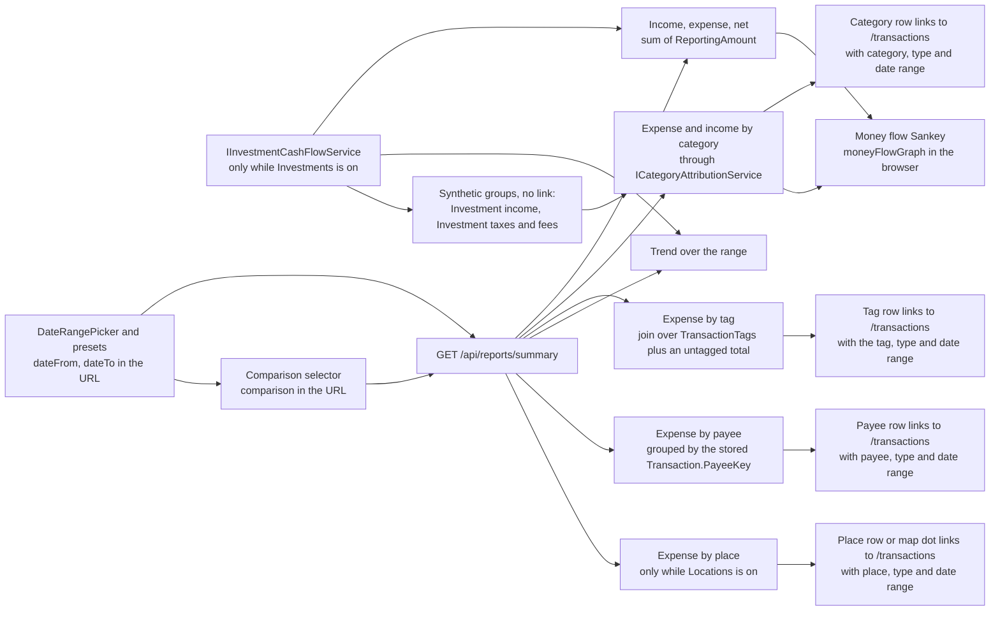
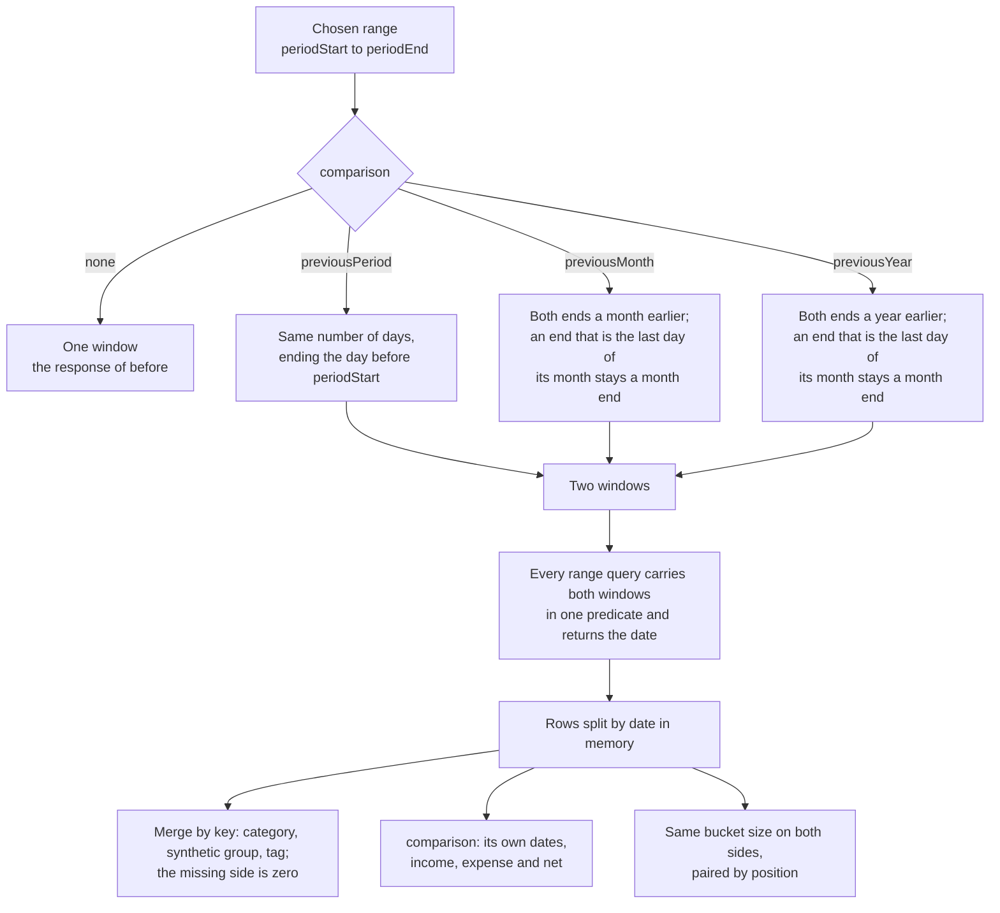

# Reports

Back to the [feature walkthrough](README.md). See also [decisions](../decisions/reports.md).

Backend `Reports`, page `/reports`. One endpoint, `GET /api/reports/summary`, for any date range; the year presets use the same report. The same endpoint can answer a second, earlier period beside the chosen one; see [Comparing with an earlier period](#comparing-with-an-earlier-period).

`dateTo` defaults to today and `dateFrom` to the first day of `dateTo`'s month. `GetReportSummaryValidator` answers 400 `range.invalid` for a date outside 2000-01-01 to 2999-12-31, the years `MonthKey` supports, and for a `dateFrom` after the end, which is today when `dateTo` is left out. Before it, a start after the end returned an empty report without saying why, and a date at the edge of what `DateOnly` holds failed with a server error when the range or the earlier comparison period was worked out. `ReportEndpointTests` cover each refusal.

## Comparing with an earlier period

A report can carry a second period beside the one it was asked for. The client sends `comparison=previousPeriod`, `comparison=previousMonth` or `comparison=previousYear`; without the parameter nothing about the answer changes and nothing extra is read.

### How the earlier range is derived

`ComparisonWindow.For` in `Endpoints/Reports/Shared` is the only place that decides it, from the range the report already resolved, so it uses the installation time zone exactly as the rest of the report does.

**The previous period** is a count of days: the chosen range is `n` days long, and the earlier one is the `n` days ending the day before it starts. It is deliberately not "the previous calendar month": the previous period of 1–31 March is 29 January to 28 February, and a reader who wants February picks February. The selector says "Previous period" and the page prints the earlier range underneath, so what is being compared is never a guess.

**The same period last year** shifts both ends back a year with `DateOnly.AddYears`, which clamps 29 February to 28 February, and then keeps a month end a month end: when the chosen range ends on the last day of its month, the earlier range ends on the last day of that month a year earlier. That single rule settles both awkward cases.

| Chosen range | A year earlier | Why |
| --- | --- | --- |
| 1–31 March 2026 | 1–31 March 2025 | Nothing to clamp |
| 1–28 February 2025 | 1–29 February 2024 | 28 February is a month end, so February meets the whole of February |
| 1–29 February 2024 | 1–28 February 2023 | The same rule, the other way round |
| 29 February 2024 alone | 28 February 2023 | `AddYears` clamps the start, and the end is the month end |
| 10–20 April 2026 | 10–20 April 2025 | Mid-month, nothing snaps |
| 1 January – 31 December 2026 | 1 January – 31 December 2025 | A whole year is a month end at each end |

**The same period last month**, added with [month-end close](month-end-close.md), is the same rule one month back instead of twelve: both ends move back a month with `DateOnly.AddMonths`, which clamps a day the earlier month lacks, and an end on a month end stays on a month end. It is what `PreviousPeriod` is deliberately not, the previous calendar month, and the month-end page asks for it for every month it shows. The selector offers it as "Same period last month", between "Previous period" and "Same period last year".

| Chosen range | A month earlier | Why |
| --- | --- | --- |
| 1–31 March 2026 | 1–28 February 2026 | 31 March is a month end, so March meets the whole of February |
| 1–29 February 2024 | 1–31 January 2024 | The month end snaps forward in a leap year too |
| 1–30 April 2026 | 1–31 March 2026 | 30 April is a month end, so the earlier end is 31 March, not 30 March |
| 10–20 April 2026 | 10–20 March 2026 | Mid-month, nothing snaps |

`ComparisonWindowTests` covers the month-end, leap-year and mid-month cases, January against the December before it, and a single 30 March, which meets 28 February because `AddMonths` clamps it.

### What the response carries

`comparison` holds the earlier period's `mode`, `periodStart`, `periodEnd`, `totalIncome`, `totalExpense` and `net`. Every `CategoryBreakdownItem`, `TagBreakdownItem` and `PayeeBreakdownItem` fills `comparisonAmount`, and every `ReportTrendPoint` gains `comparisonBucketStart`, `comparisonIncome` and `comparisonExpense`. All of them are null when no comparison was asked for, so a client written against the older shape is unaffected.

The breakdowns are merged on their key — the category id, the synthetic group, the tag id, the payee key, or "none of those" for the uncategorized and untagged entries. A key only one period touched is still one entry, with `0.00` on the side that has nothing, because a category that stopped costing anything is the most interesting row a comparison has. That is also why the list is sorted by the larger of the two amounts rather than by the current one: a category that fell to zero keeps its place near the top instead of sinking out of sight. The list does not grow without bound — it is at most the union of two periods' categories or tags — and the page still shows five categories and eight tags, rolling the rest into "Other", with the earlier amounts of the rolled-up rows added into that row too.

The trend keeps the bucket size the chosen range decides (daily up to 62 days, monthly beyond) and applies it to both sides, then pairs bucket *i* of the range with bucket *i* of the earlier one. A bucket with no counterpart compares against zero; a counterpart past the end of the range is not drawn, though its amounts are still inside the comparison totals. `comparisonBucketStart` says which earlier bucket a point was paired with, so the chart can name it.

### The difference and the zero base

The server answers amounts, not differences. The client subtracts and divides in one place, `changeOf` in `src/lib/comparison.ts`, which returns the amount, a percentage and a direction. When the earlier amount is zero there is no percentage to compute, and the page says "up from nothing" instead of inventing an infinity; a fall *to* zero is an ordinary −100%, because its base is real. Zero against zero is flat and also has no percentage.

`ChangeBadge` renders that verdict. Better and worse never depend on colour alone: the badge carries an arrow that points up, down or sideways, the amount always carries its own `+` or `−`, and a screen reader hears "better than the earlier period", "worse than the earlier period" or "unchanged from the earlier period". Whether up is better is per figure — more income is better, more spending is worse — so income, expense, net and the two breakdowns each say which direction they want.

### The cost

The comparison must not double the work, so it is not a second pass. Each range-scoped query already ran once per report; it now carries both windows in one predicate (`Date` inside either window) and returns the date, and the rows are split between the two periods in memory. `ICategoryAttributionService` and `IInvestmentCashFlowService` take the second window as a nullable parameter and build the narrower predicate when it is absent, so a report without a comparison emits exactly the query it emitted before. The number of round trips per report is the same whether a comparison was asked for or not — in fact one lower than before, because the totals are now summed from the same grouped query the trend uses instead of a separate aggregate.

The alternative, widening one range to span both, was rejected: for the previous period the two windows are adjacent and it would be the same thing, but for the same period a year earlier it would read a whole year of rows to show two months.

### What is not exported

The CSV and PDF buttons on the page are transaction exports (`/api/transactions/export`), not exports of the report, so they are unchanged and carry no comparison. See [Exports](exports.md).

## Expense breakdown by tag

`expenseByTag` sits beside the two category breakdowns and answers the other question a household asks of a period: not what kind of spending it was, but what it was for. It holds one `TagBreakdownItem` per tag the period touches, sorted by amount, and a final item with `tagId` null for the expenses that carry no tag at all. The amounts are sums of `ReportingAmount` over whole transactions, because a tag sits on the transaction and never on a split line, so there is no proration to do.

A transaction can carry several tags, and then it counts once under each of them. The tag items can therefore add up to more than `totalExpense`; only the untagged item is disjoint from the rest. That is the nature of the question — one receipt really can be both the holiday and the thing a colleague will pay back — and the page says so in a line under the list. Investment cash flows carry no tag and are left out of the list entirely, so it can also come to less than `totalExpense`.

The list covers expenses only. Tags in practice mark spending themes, the untagged group is about spending, and an income split by tag would double the page for a question `incomeByCategory` already answers. Visibility needs no code: the breakdown joins `TransactionTags` onto `db.Transactions`, which is already scoped by account visibility and by the active household, and the names come from `db.Tags`, filtered exactly as categories are. Tags are described in full on [Tags](tags.md).

## Expense by payee

`expenseByPayee` answers "how much went to Maxima this year" for whatever range and comparison the page shows. It holds one `PayeeBreakdownItem` per payee, with `payeeKey`, `label`, `amount`, `comparisonAmount` and `count`, and the page shows it as "Expense by payee" under the tag breakdown, behind the same `Reports` switch.

**What a payee is.** `SubscriptionDescription.Normalize` of the statement's payee on a row imported since 2026-10-01 that carries one, otherwise of the description (see [The statement's payee](bank-statement-import.md#the-statements-payee)); the key unusual amounts, subscription detection and suggested rules already group by: lowercase words, punctuation gone, and any token that is all digits or carries three or more of them dropped. "MAXIMA LT, UAB 20260302" and "Maxima LT UAB 20260320" are one payee, `maxima lt uab`, so reference numbers and dates on card lines do not split one shop into many rows. The key is stored on every transaction as `PayeeKey` (see [Data model](../data-model.md#payee-key)), which makes the report one grouped query like the tag breakdown and lets the ledger filter on exactly the same key. A chain whose shops print different texts, such as "maxima x vilnius" and "maxima kaunas", stays several payees; the ledger's text search and its totals answer "all of Maxima" (see [decisions](../decisions/reports.md)).

**What is counted.** Expenses only, as the sum of `ReportingAmount` over whole transactions: a split transaction counts once under its own description, because a split divides one payment between categories, not between payees. Income and the investment ledger's entries are left out, so the list can add up to less than `totalExpense`. The expenses without a description, or with nothing left after normalizing, are one entry with `payeeKey` and `label` null, which the page shows muted as "No description" and without a link. Visibility and the active household come from the query filter on `db.Transactions`, exactly as for tags, so a shared account's rows appear for every member.

**How many.** The server returns at most `PayeeBreakdownItem.MaxItems`, 50 entries, ordered by the larger of the two amounts like the other breakdowns, so a payee that stopped costing anything keeps its place with `amount` `0.00`. The page shows eight and **Show all** reveals the rest in place; the shares are of the rows shown. Anything below the fifty is one ledger search away.

**The name.** Since 2026-09-30 each item also carries `name`, the member's own name for the key from [Payee names](payee-names.md), and the page shows it before the label.

**The label** is the newest description of the key, read by a second query for the listed keys only. The earlier period always lies before the chosen range, so that is the newest description inside the range when the payee has one there, and the newest of the earlier period otherwise. It reads like the bank text people recognise. `count` is the number of the payee's transactions inside the range.

**Drill-through.** Each named row links to `/transactions` with `payee` set to the key, `type=expense` and the range. The ledger's `payee` filter keeps `PayeeKey == Normalize(value)`, so its list, its totals and both exports hold exactly the rows behind the amount; see [Transactions](transactions.md#payee-filter). The list itself is not exported, like the other breakdowns (see [What is not exported](#what-is-not-exported)).

The month-end review's `figures` are this same report summary, so they carry the list as well; the month-end page does not show it.

## Expense by place

Since 2026-10-01, while the [`Locations`](transaction-locations.md) switch is on, `expenseByPlace` answers "how much did the Maxima on Ozo street cost" for the same range and comparison. It holds at most `PlaceBreakdownItem.MaxItems`, 50 `PlaceBreakdownItem`s with `place`, `amount`, `comparisonAmount`, `count`, `latitude` and `longitude`, and is empty while the switch is off. It is built like expense by payee: expenses only, whole transactions except that a spread payment counts by the monthly slices that fall in each period (`SpreadSlice` carries the place), grouped by the trimmed, lower-cased place, ordered by the larger of the two amounts. The name is the newest spelling in the range, read with the average of the stored coordinates by `PlaceSpellings` from the same rows. The expenses without a place are one entry with `place` null, shown muted as "No place" without a link. The page shows the list as "Expense by place" after the payee list, eight rows and **Show all**; each named row links to the ledger with `place`, `type=expense` and the range. The ledger's `place` filter matches by substring, so its totals equal the amount unless the name is part of a longer place's name. When the map tile file is on the server, a List and Map switch shows the same entries as dots on a map of Lithuania; see [Transaction locations](transaction-locations.md#the-map).

## Year in review

Since 2026-09-30 the page adds a "Year in review" section, after the net worth change, whenever the range is "This year" or "Last year". It needs no endpoint: `year-review-rows.ts` reads the report the page already has. A table lists each month of the trend with its income, expenses, net and the share of income kept, "—" for a month without income. Under it "Biggest changes from the year before" lists the five expense categories whose amount moved most against the comparison, either way, with "€4,200.00, was €3,900.00" and the change badge that calls a fall better; without the "Same period last year" comparison it offers "Compare with the year before", which turns that comparison on. Investment groups and unchanged categories are left out. The year's totals, the net worth change and the breakdowns are the ones the page shows for any range.

## Money flow

Since 2026-09-30 the page ends with a "Money flow" section, full width under the breakdowns and the trend, for any range. It is a Sankey diagram built in the browser by `moneyFlowGraph` (`features/reports/money-flow/money-flow-graph.ts`) from the report the page already has; there is no endpoint of its own.

- **Left:** the income categories, then **Money back** and **From savings** when they apply.
- **Middle:** one **Money in** node, the sum of the left side.
- **Right:** the expense categories, then **Saved** when the period ended with money left.

The two extra left-hand nodes keep both sides of the hub equal, so the chart never invents money. Amounts are summed in cents with `toCents`, so the hub balances exactly.

- **Saved** is `max(0, totalIncome − totalExpense)`: always the Net stat above and the year review's Kept column, even when there is money back.
- **From savings** is `max(0, totalExpense − totalIncome)`, joining when the period spent more than it earned; a period with only expenses is paid from savings in full.
- **Money back** gathers every expense category, after the roll-up to its group, whose [refunds](transactions.md#refunds) outweighed its spending, as a positive amount. Its tooltip names each category, and one line under the chart repeats them: "Money back: Electronics €40.00 (more refunded than spent)". A refund-heavy sub-category inside a group that still spent stays inside the group. Income categories below zero, which the report does not produce today, are left out rather than drawn as money back.

Each side shows the rows of the list above it: `breakdownCut` in `components/category-breakdown/category-groups.ts` rolls sub-categories up to their group with `rollUpToGroups`, sorts by `breakdownWeight` and keeps five rows with the rest in **Other**, and `CategoryBreakdown` calls the same function. With a comparison on, the chart keeps the lists' comparison-aware choice of rows, but every amount is the chosen period's and the earlier period is not drawn. Money back is taken out before the cut, so a refund-heavy category never takes one of the five places in the chart; a category with no amount in the period has no node.

Clicking an income or expense category, or a group, opens `/transactions` with the same search the list row's link builds: `categoryId`, `type` and the range. A group's id includes its sub-categories, as the ledger's category filter already does. Investment income, investment taxes and fees, Uncategorized, Other, Money in, Money back, From savings and Saved are not clickable. The chart stays out of the tab order like every chart; keyboard users reach the same ledger views through the lists. Names come from `useCategoryName` and amounts from `useMoney`, so Hide amounts masks the labels, the tooltip and the Money back line.

Below `lg` the section is hidden and the lists stay the view: a horizontal flow of long Lithuanian names does not fit a phone, and at `md` width the plot between the labels was too narrow to read. When both totals are zero the section shows "Nothing recorded in this period." instead of the chart. The month-end review does not show it yet; the component takes a report summary, so it can be reused there without change.

## My share

Since 2026-10-02, with [My share](household-settle-up.md#my-share) pressed in the page header, the report asks with `share=mine`: an expense split with a household or with people counts at the member's own part, and a household split another member paid counts at the member's share, in every total, the trend, the category, tag, payee and place breakdowns and the comparison period alike. A share whose transaction the member cannot see counts on the split's date without tag, payee or place, and a payee or place keeps the count of its own rows. Without the toggle nothing changes.

## What counts as income and expense

Two ledgers feed the report. Ordinary transactions contribute their `ReportingAmount` by `FlowType`, as before. While the `Investments` feature is on, the investment ledger contributes too, through `IInvestmentCashFlowService` in `Common/InvestmentCashFlows`:

| Investment entry | In the report |
| --- | --- |
| Dividend, Interest | income |
| WithholdingTax, standalone Fee | expense |
| Buy, Sell, Split | nothing |

A buy moves money into a holding and a sell moves it back, so neither is income or expense. The realised gain of a sale stays in the portfolio view on `/investments` and is not report income. The commission of a buy or sell is part of its cost or proceeds (decision of 2026-09-19) and therefore stays out as well; only `Fee` entries of their own count. The amount used is the entry's frozen `ReportingAmount`, so a dividend paid in US dollars counts at the rate of its own date, exactly like a foreign-currency transaction. The side is decided by the entry type and the sign is kept, the same way the portfolio totals on `/investments` are built: a dividend reversal or margin interest that the broker reports as a negative amount lowers income instead of raising expense, and a withholding tax refund lowers expense. Net is the same either way.

With the feature off the service returns nothing and every figure equals the sum of the transactions alone.

A [refund](transactions.md#refunds) is an expense with a negative amount, so every figure here is net of refunds: the totals, the trend, and the category, tag and payee breakdowns. A category, tag or payee whose refunds exceed its spending in the range keeps its negative net and is ordered last; the lists draw only positive items, give a negative one an empty bar and no share, and still add up to the total; past the first five categories it folds into Other like any category. A payee's `count` includes its refunds.

A transaction [spread over months](transactions.md#spreading-over-months) counts one monthly slice in each month it covers, in the totals, the trend and every breakdown, so the totals still equal the sum of the categories and a year counts the whole amount once. A payee's `count` counts a spread row once for every period its slices touch. The category, tag and payee links, and the money flow's category links, carry `spreadOverlap=true` with the range, so the ledger lists the spread rows dated before the range beside the rest and the chip on each says how much of it falls in the range.

Visibility needs no code in the report. `InvestmentTransaction` is `IAccountScoped`, so the global query filter in `AppDbContext` shows a caller only entries on accounts visible to them, the same filter that scopes `Transaction`. The report has no account filter of its own.

## Category breakdown and the synthetic groups

The response carries `expenseByCategory` and, new with this change, `incomeByCategory`; both are lists of `CategoryBreakdownItem`. Investment entries have no category, so their total arrives as one extra item per list: `categoryId` null, a plain English `categoryName` as a fallback, an icon name, and `syntheticGroup` set to `investmentIncome` or `investmentTaxesAndFees`. Every other item, the uncategorized one included, has `syntheticGroup` null. The field and the income list are additions, so a client written against the older shape keeps working: it sees an item without a category id, which it already had to handle for uncategorized spending, and shows the English name.

The reports page reads `syntheticGroup`, takes the name from `reports.syntheticGroups.*` in the locale files (English and Lithuanian) and renders the row as text, never as a link, because there is no category to filter `/transactions` by. A group appears only when its total is above zero; in the rare period where refunds exceed the tax and fees, the totals still carry the negative amount and the list simply has no row for it.

The dashboard uses the same service and the same builder (`CategoryBreakdownBuilder` in `Endpoints/Dashboard/Shared`): its month income and expense, its monthly trend and its spending breakdown include the same investment flows, so the dashboard month and the report for that month always agree. Budgets are untouched: a budget belongs to a category and these amounts have none. The CSV and PDF exports on this page remain transaction exports and do not list investment entries, so their totals can be lower than the report's when the period holds dividends.
