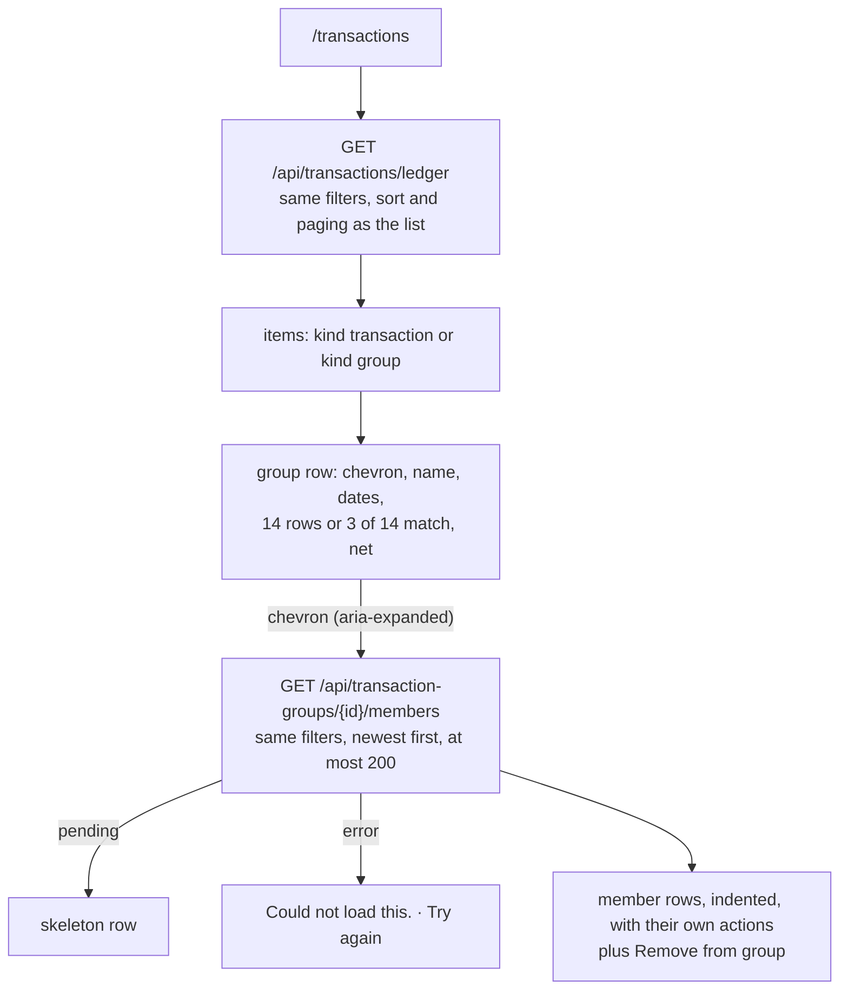

# Transaction groups

Back to the [feature walkthrough](README.md). See also [decisions](../decisions/transaction-groups.md), [transactions](transactions.md), [tags](tags.md), [trash and undo](trash-and-undo.md).

Backend `TransactionGroups` (`GET`, `POST`, `PUT` and `DELETE` on `/api/transaction-groups`, `TransactionGroupService` behind `ITransactionGroupService`), `Transactions` (`GET /api/transactions/ledger` through `TransactionService.GetLedgerPageAsync` and `LedgerKeys`, `groupId` and `enteredByMe` on every transaction response, the `Group` column of `TransactionCsvWriter`), `Trash` (the `transactionGroup` kind), `Infrastructure/BackgroundJobs/Retention`, `Users` (the member export and import); frontend `transactions/ledger-groups` (`useLedgerGroups`, `ledger-rows.ts`, `group-row.tsx`), `transactions/group-dialog`, the Group button of `transactions/selection-toolbar` and the Add to group… and Remove from group actions of `transactions/transaction-row-actions`. No feature switch: like tags, a group is a way of reading ledger rows, not a page of its own.

A card statement prints a trip to Riga as fourteen lines between the groceries. A group folds them into one ledger row, "Kelionė į Rygą · 3 Jul – 17 Jul 2026 · 14 rows · −€612.40", that opens in place to show the fourteen lines. Grouping changes how the ledger reads, not what the figures say: every member keeps its own date, category, account and amount everywhere else. The plan was gated on a daily-use trial; the owner waived the gate on 2026-10-01 and asked for the feature to be built.

## Creating a group

- **From a selection.** On the desktop, ticking two or more rows offers **Group** in the selection toolbar, enabled when every ticked row was entered by you (`enteredByMe`). The dialog asks for a name and sends `POST /api/transaction-groups` with the ids. Split rows cannot be ticked, as for bulk recategorizing.
- **From a row.** The actions menu of a row you entered that is in no group offers **Add to group…**, on the desktop and the phone, split rows included. The dialog offers **New group**, which starts a group with that row alone, or **Existing group**, a search list of `GET /api/transaction-groups` with each group's dates and size, which sends `POST /api/transaction-groups/{id}/members`. With no groups yet it says so and asks for a name. The phone has no selection, so this is how a group is started there.
- A row is in at most one group. Adding a row that is in another group is refused with 409 `transactionGroup.memberTaken`; take it out of that group first. Names are not unique, at most 120 characters (`TransactionGroup.NameMaxLength`).

## The group row

The group row shows the date range of its matching members, the chevron button named "Show the 14 rows of Trip to Riga" with `aria-expanded`, the name, the member count or "3 of 14 match" under a filter, and the net in the reporting currency through `TransactionAmount`, so privacy mode masks it like every other amount. The net is the sum of the members' reporting amounts with income positive, so a group of expenses reads as a minus and a deposit that came back lowers it. Expanding fetches the members with the ledger's current filter and shows them as rows of the same table, marked with an indent arrow instead of a checkbox, each with its ordinary actions and **Remove from group**; on the phone they are indented in the list. The expansion is kept per view like the selection, so it is cleared by any navigation. More than 200 matching members shows the first 200 and says so.

The row's actions are **Rename group**, which opens the same dialog with the name, and **Ungroup**, which asks first, keeps every member, puts the group in the trash and raises the undo toast; focus then moves to the first former member. A group left with one member, or with none visible under the current filter, stays: one live member still shows as a group, and none shows nothing.

## Filters and sorting

Filters apply to the members. A group appears when at least one member matches, and its `matchingCount`, date range and net count only the matching members, while `memberCount` counts them all, so an unfiltered ledger shows the whole group. The pager counts ledger items; the totals line above the table still counts transactions, from `GET /api/transactions/summary`, which is unchanged.

| Sort | Where a group goes |
| --- | --- |
| Date | at its newest matching member, so an ongoing group stays near the top of the default newest-first order |
| Amount | by the size of its net, as transactions sort by their reporting amount |
| Description | by its name |
| Category, account | after every transaction in either direction, by name, because a group has neither |

Ties fall back to the creation time and then the id, so paging never shows an item twice. How the query is built is in [architecture](../architecture/transactions.md#ledger-items-and-groups).

## Everywhere else

Reports, budgets, balances, the month-end close, the dashboard's recent transactions, the import review, the Sankey, the Beancount journal and both exports count each member as the row it is. `GET /api/transactions` is unchanged apart from the two new response fields and never folds anything, so the recent-transactions card and the import review keep reading it. Adding, removing and ungrouping write only `GroupId`, with `ExecuteUpdateAsync` and without touching `UpdatedAt`, so a closed month shows no drift from grouping alone, and the household activity log never sees a group, since `GroupId` is not one of the audited transaction fields.

## Ownership and housemates

Groups are personal. A group holds only rows you entered (`UserId` is you), and a visible row a housemate entered on a shared account answers 403 `access.forbidden`, an invisible one 404. A housemate who sees your members on a shared account sees ordinary rows: their ledger never folds them, their responses answer `groupId` null, and `GET /api/transaction-groups` and the members route answer only their own groups. Every transaction response carries `enteredByMe`, which is what the ledger reads to offer Group and Add to group….

## The API

| Method | Route | Does |
| --- | --- | --- |
| GET | `/api/transactions/ledger` | `PagedResponse<LedgerItemResponse>`: `kind` (`transaction` or `group`), `transaction` and `group` (`id`, `name`, `firstDate`, `lastDate`, `memberCount`, `matchingCount`, `netReportingAmount`), with the filters, sort and paging of `GET /api/transactions` |
| GET | `/api/transaction-groups` | your groups with at least one live member, newest member first: `id`, `name`, `memberCount`, `firstDate`, `lastDate` |
| POST | `/api/transaction-groups` | `{ name, transactionIds }`, 1 to 200 rows; 201 with the group and `Location` |
| PUT | `/api/transaction-groups/{id}` | `{ name }`; 200 with the group |
| POST | `/api/transaction-groups/{id}/members` | `{ transactionIds }`, 1 to 200; 204; a row already in this group is left as it is |
| DELETE | `/api/transaction-groups/{id}/members/{transactionId}` | 204; 404 when the row is not in the group |
| DELETE | `/api/transaction-groups/{id}` | ungroup; 204 |
| GET | `/api/transaction-groups/{id}/members` | the matching members under the ledger's filters, newest first, as `{ items, truncated }`, at most 200 |

The name uses `text.tooShort` and `text.tooLong`, an empty list `required` and more than 200 rows `collection.invalidSize`. The three `GET` routes are readable with a [personal API token](personal-api-tokens.md); the writes are not token-writable and stay with the browser session, because grouping is a reading aid, not bookkeeping a script needs.

## Trash and retention

Ungroup is a delete of kind `transactionGroup`: the trash row reads "Trip to Riga, 14 transactions", and every member is recorded as a `GroupMember` change. A restore puts the name back and regroups the recorded members that are still live and in no other live group. A member deleted while grouped keeps its `GroupId`, so restoring it brings it back into its group while the group is live; after an ungroup it comes back as an ordinary row, because the ledger treats a `GroupId` that points at a deleted group as no group. 30 days after an ungroup `RetentionJob` purges the group row, after the transactions, and the foreign key's `ON DELETE SET NULL` clears any trashed member still pointing at it. See [Trash and undo](trash-and-undo.md).

## Exports and the member export

The transaction CSV gains a `Group` column after `Place` with the name of your group, empty for a row in no group or in someone else's. The member export carries the `TransactionGroups` table as an owned table and fills the same column in `transactions.csv`; an import into an empty member keeps the grouping, and a row on the member's account entered by a housemate, whose group is outside the export, comes in with its `GroupId` cleared by the import's repair step. The PDF has no group column, and the Beancount journal is unchanged.

## Tests

`TransactionGroupLedgerTests` covers one ledger item per group under every sort and direction while paging two at a time, the newest member's date and the net's size as sort keys, groups after transactions for category and account, the filter with `matchingCount` and the members route, the summary, both exports, the report, budgets, balance and `GET /api/transactions` unchanged by grouping, and a closed month without drift after grouping, adding, removing, ungrouping and restoring. `TransactionGroupTests` covers create, rename, list and remove, validation, 403 and 404, `transactionGroup.memberTaken`, the housemate's view, ungroup and restore, a member trashed while grouped and one restored after an ungroup, and the CSV's group name. `UserImportTests` round-trips a group through the member export. The unit tests are `LedgerKeysTests` (the SQL shape of the union per sort), `TrashRestorersTests`, `RetentionTests`, `UserExportTablesTests`, `TokenReadableTests` and `TokenWritableTests`, and `ledger-page.test.ts` for the optimistic create and delete on a cached ledger page. Stories: `GroupRow` (collapsed, expanded, partial match, members pending, members error, ungrouping), `GroupDialog` (from the selection, from a row with and without groups, renaming, pending, `transactionGroup.memberTaken`), the phone list's group rows, and the transactions page's `GroupingTwoSelectedRows`.
