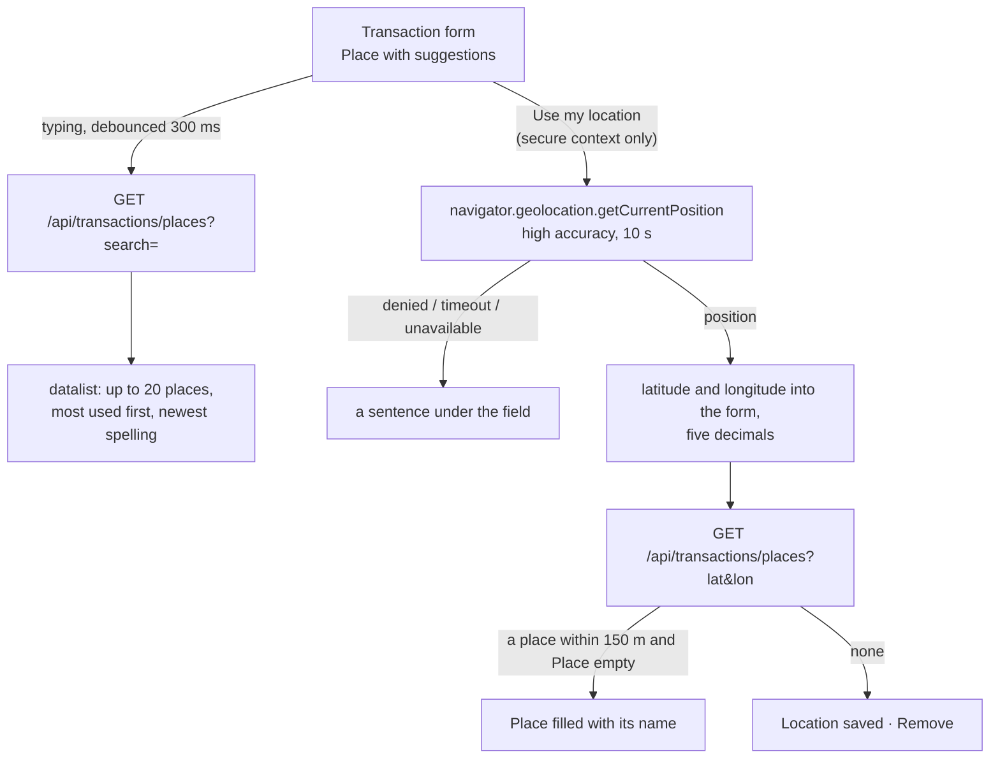

# Transaction locations

Back to the [feature walkthrough](README.md). See also [decisions](../decisions/transaction-locations.md), [transactions](transactions.md), [receipt reading](receipt-reading.md), [reports](reports.md#expense-by-place), [deployment](../architecture/deployment.md#the-map-tile-file).

Backend `Transactions` (`Place`, `Latitude` and `Longitude` on the transaction, the `place` filter, `GET /api/transactions/places` through `IPlaceService` and `PlaceService`), `Common/Places` (`PlaceSpellings`, `GeoDistance`), `Reports` (`expenseByPlace`), `Infrastructure/Receipts` (`ReceiptTextParser.AddressOf`, `PhotoLocation`); frontend `transactions/place-field`, the place parts of `transactions/receipt-reading`, the ledger filters, `reports/place-breakdown` and `reports/place-map`. Feature switch `Locations`, off by default.

A bank line says "MAXIMA LT, UAB 20260917"; it does not say which Maxima. A transaction can now carry a place of the member's own, such as "Maxima, Ozo g. 18, Vilnius", and, on request, the position where it was paid. The ledger finds rows by place, and Reports shows what each place cost, as a list and, when the administrator has put a map file on the server, on a map of Lithuania.

## Nothing leaves the installation

The application makes no request to an outside service for places. Names come from the household's own earlier places, never from a geocoding service, and the map is drawn from a tile file served by the installation's own Caddy. One caveat is outside the application's control: when a member presses **Use my location**, the browser or the operating system may ask its own network location service (Google, Apple or Microsoft, depending on the device) to work out the position from nearby Wi-Fi and cell towers. That request is the browser's, not the page's, so the Content-Security-Policy does not govern it; a member who does not want it types the place instead.

## The switch

`Locations` is part of `FeatureFlags` and starts off, like `ApiTokens`, so an installation that upgrades sees no change until an administrator ticks **Places** under Settings › Installation › Features. While it is off:

- every transaction response answers `place`, `latitude` and `longitude` as null, and the report's `expenseByPlace` is empty;
- a create stores none of the three and an update keeps the stored values instead of clearing them, so switching it on again shows them as they were;
- the `place` filter is ignored and the search does not look at places;
- `GET /api/transactions/places` answers `feature.disabled`;
- the reading of a receipt answers no photo position;
- the form, the filters and the report show nothing of it.

The only differences from before the feature, with the switch off, are the `Permissions-Policy` header, which now lets the site itself ask for the position, and the empty `Place` column at the end of the CSV.

## The place field

**Place** is a text field of at most 120 characters (`TransactionPlace.MaxLength`), trimmed, with empty meaning none. It is a plain input with a native `<datalist>`, so it takes any text, suggests the places used before, and on a phone the browser shows the suggestions in its own picker. The suggestions come from `GET /api/transactions/places?search=`, asked 300 ms after the member stops typing. With no earlier places the list is empty and the field behaves like any text input.

**Use my location** is shown only where the page is a secure context, HTTPS or localhost; on plain HTTP, such as the development Caddy opened from a phone over the LAN, the browser would refuse anyway. The position is asked for only when the button is pressed, never when the form opens. The handler asks `navigator.geolocation.getCurrentPosition` once with `enableHighAccuracy` and a 10-second timeout, rounds the coordinates to five decimals (about a metre), writes them into the form and asks the places endpoint for a place within 150 metres. When one comes back and Place is still empty, its name fills the field; otherwise the name is left for the member to type. While coordinates are set the field shows "Location saved · Remove", and Remove clears them. A refused permission reads "The browser was not allowed to share your location…", a timeout "Your location could not be found in time…", and anything else "Your location is not available right now…".

## Suggestions

`GET /api/transactions/places` takes `search` (at most 120 characters), and `lat` and `lon`, which come together and within range or are refused with `transaction.locationInvalid`. It reads the transactions the caller can see, narrowed by the active household like every list, and answers up to 20 places. `PlaceSpellings` groups the distinct stored places by their trimmed, lower-cased text, so "maxima ozas" and "Maxima Ozas" are one place named by the newest spelling (latest date, then latest creation), with the number of transactions and the average of the coordinates stored with them, null when none has any. Places are ordered by that count. With `lat` and `lon`, the nearest place within 150 metres by the haversine distance (`GeoDistance`) comes first with `nearby: true`; the distance is taken in memory over the grouped places, which are a few hundred at most. The route is token-readable and needs the `Locations` switch.

The partial index `IX_Transactions_Place` on `(AccountId, Place)` where a place is set serves the grouping; the substring filter scans, as the description search does.

## Receipts

**Fill from receipt** fills Place with the merchant and the receipt's address line, "MAXIMA LT, UAB, Savanorių pr. 247, LT-02300 Vilnius", cut to 120 characters, when Place is empty. `ReceiptTextParser` finds the address as the first header line after the merchant line that has a street number and either an `LT-12345` postcode or a known Lithuanian city, and stores it in the reading as `address`. Readings cached before this change have no address until they are read again with Read again.

When a freshly uploaded photo carries GPS coordinates in its EXIF, `ReceiptService.LoadUploadAsync` reads them with Magick.NET (`PhotoLocation`, the `GPSLatitude` and `GPSLongitude` rationals signed by their `Ref` tags) just before [`AttachmentImage.WithoutMetadata`](attachments.md#location-and-other-metadata) strips them, and returns them as `photoLatitude` and `photoLongitude` on the reading response while both `ReceiptReading` and `Locations` are on. They are never put in the cached `ReceiptReading.Result`, which travels in backups and the member export, and they are never set on the transaction silently: after the review the form offers **Use the photo's location**, because a photo taken at home later carries the home's position. A fresh upload that is answered from the reading cache still reads its own tags. A PDF, or a reading of an attachment stored earlier, carries none, since stored images no longer keep their metadata.

## Ledger

The ledger search also matches the place while the switch is on. The filters gain **Place**, a substring match ignoring case (`TransactionFilterRequest.Place`, at most 120 characters): on the desktop it sits with the search under the Description column's filter, on the phone in the Filter and sort dialog, and an active one shows as a chip, "Place: “Ozo g.”". The same filter drives the list, the totals line and both exports, and saved filters keep it. The table gains no column; the place is seen in the edit dialog. Templates keep the place. **Duplicate** and **Record refund** copy the place but not the coordinates, since a duplicate is usually the same shop another day while coordinates record where one payment was made. Confirming a recurring entry and every bank import leave both empty; filling the place from OFX `PAYEE` addresses is a [backlog](../backlog.md) item, because the address in bank files is usually the registered office rather than the shop.

## Report

Reports gains **Expense by place** after Expense by payee, built the same way: expenses in the range, spread payments counted by their monthly slices, grouped by the trimmed, lower-cased place under its newest spelling in the range, the top 50 by the larger of the two amounts, with the count and, when compared, the earlier amount; the expenses without a place are one "No place" entry. Each entry also carries the average of its stored coordinates. A name links to the ledger filtered by that place, type and range, whose totals equal the entry unless the name is part of another place's name. The section is shown only while the switch is on. See [reports](reports.md#expense-by-place).

## The map

When the administrator has put `lithuania.pmtiles` in the `maps` volume ([deployment](../architecture/deployment.md#the-map-tile-file)), the section gains a **List** and **Map** switch. The reports page finds out with one `HEAD /maps/lithuania.pmtiles`, since the API cannot see Caddy's volume; the switch appears only when it answers 2xx with a type other than HTML, which also keeps the Vite development server's page fallback from offering a map. The owner waived the plan's gate for the map, two months of places with coordinates on a third of expenses, on 2026-10-01 and had it built with the places.

`features/reports/place-map/place-map.tsx` is loaded only when Map is chosen. It brings MapLibre GL and the PMTiles protocol, sets MapLibre's worker to the bundled same-origin file with `setWorkerUrl` (Vite's `?worker&url`), and builds its style in code: land, water, main roads, the country border and city names from the Protomaps basemap layers, in the theme's colours read from the CSS tokens, with the labels drawn by MapLibre from the bundled Source Sans 3 files through the style's `font-faces`, so no glyph server is asked. One circle layer draws a dot per place with coordinates, its area proportional to the amount (`placeFeatures`, `dotRadius`), largest first so the small dots stay on top. Clicking a dot opens the ledger filtered by that place. The map element has `role="img"` and a label naming the three places with the most spending; the list stays the text equivalent. When no place in the range has coordinates, the map says so, and a browser without WebGL gets "The map could not be drawn in this browser". Every request stays on the page's origin, and the Content-Security-Policy is unchanged: `script-src 'self'` already covers a same-origin module worker, tiles are fetched with range requests under `connect-src 'self'`, and the fonts are read from the page's own assets.

## Sharing and audit

The place travels with the transaction: a housemate who sees the row on a shared account sees its place and coordinates, like every other field. The activity log of a shared account records a change of the place as the field "place"; the coordinates are left out, because a pair of numbers is noise in the log and would be a position history of a member.

## Exports and backups

The CSV gains a `Place` column after `Spread months`, empty while the switch is off. The header is shared with the member export's `transactions.csv`, which fills it whatever the switch, since `data.json` holds the columns anyway. Coordinates stay out of the CSV; they are in the member export's `data.json` and in backups through the table.

## Errors

| Code | Status | When |
| --- | --- | --- |
| `transaction.locationInvalid` | 400 | A latitude outside −90 to 90, a longitude outside −180 to 180, or one without the other, on a transaction or on `places` |
| `text.tooLong` | 400 | A place, a place filter or a place search longer than 120 characters |
| `feature.disabled` | 404 | `GET /api/transactions/places` while `Locations` is off |

## Tests

`TransactionLocationTests` covers pairs and ranges, the trimming and rounding, the length limit, the switch off hiding the fields and ignoring them on write, an update with the switch off keeping the stored place, the filter and the search in the list, the summary and both exports, a housemate seeing the place, the audit row with the place and without the coordinates, and a read-and-write token recording and editing a place. `PlaceSuggestionTests` covers the switch, spellings, counts and averages, visibility and the active household, the nearest place at 100 m and not at 200 m, and lone or out-of-range coordinates. `PlaceBreakdownTests` covers the grouping, the match with the ledger summary filtered by place, the comparison and the switch. `ReceiptLocationTests` covers photo coordinates on an upload, none in the stored reading, the cached reading of a fresh upload, and none for an attachment or with the switch off. Unit tests cover `AddressOf` on every receipt fixture (`ReceiptTextParserTests`), GPS with north, south, east and west references on a JPEG built with EXIF in `SamplePhoto` (`PhotoLocationTests`) and the haversine distance (`GeoDistanceTests`).

On the frontend, `place-features.test.ts` covers turning places into map features and `transaction-draft.test.ts` that Duplicate and Record refund copy the place without coordinates; stories cover the place field (suggestions, none, located with and without a nearby name, a typed place kept, denied, timeout, insecure context, a saved location), the receipt fill with a photo position, the form with the switch on and off, the place chip, the Places switch, the place breakdown (list, year, compared, empty, map with places, map without coordinates, tile file missing) and the map. `e2e/place-map.spec.ts` turns the switch on, records a placed expense, opens the map on the reports page and checks that it draws from the fixture tile file with every request on the page's origin.
