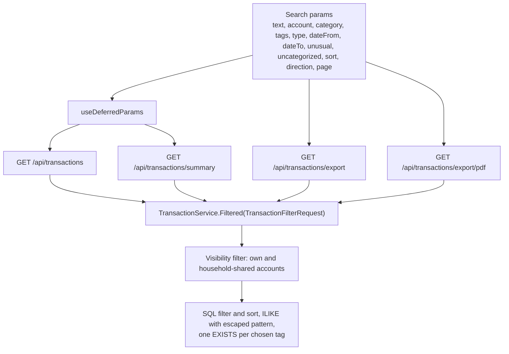
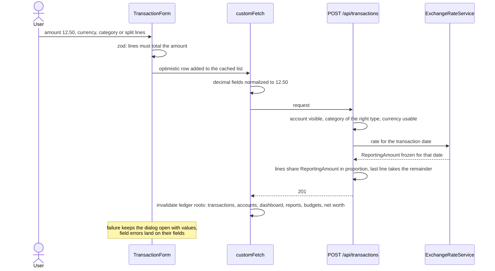
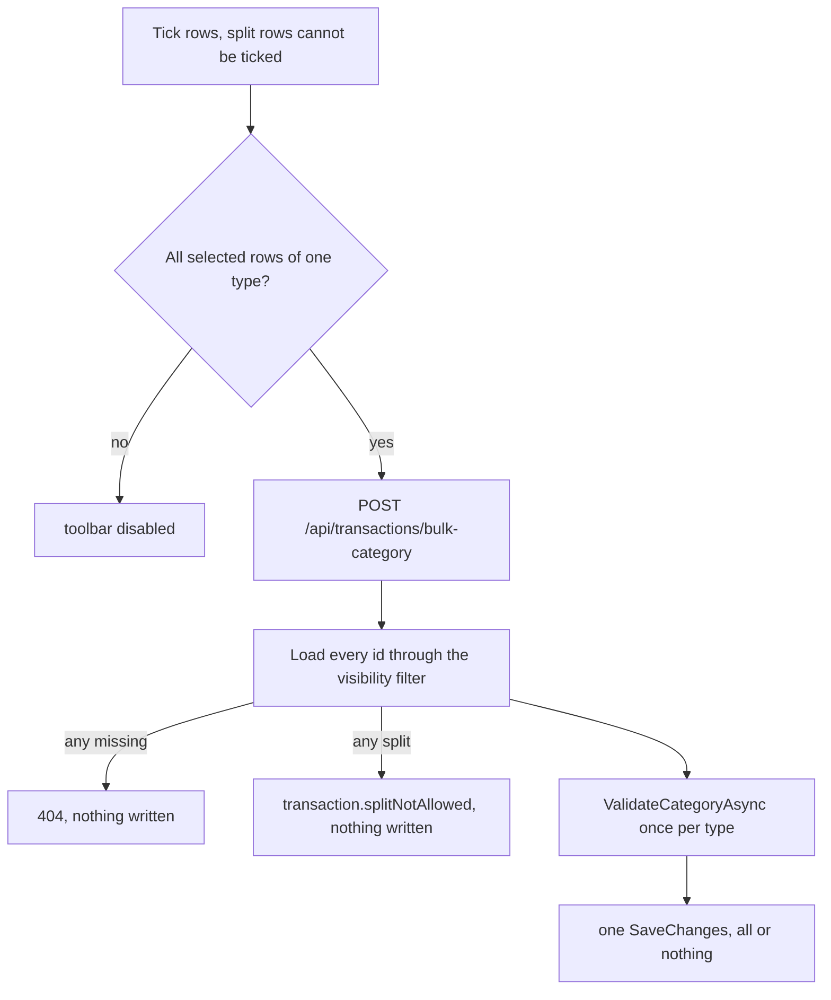
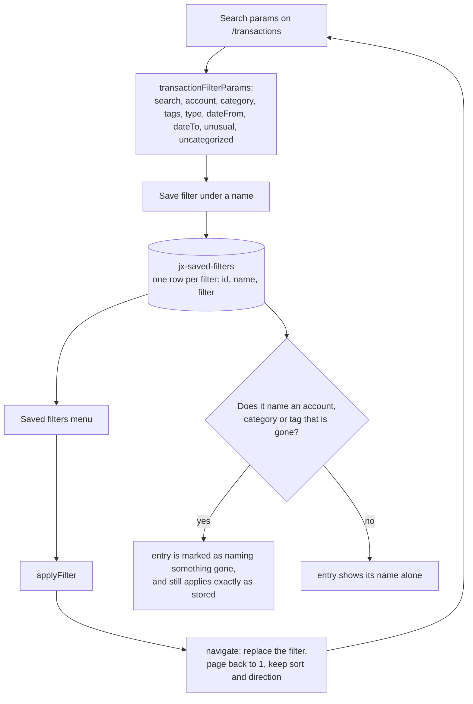
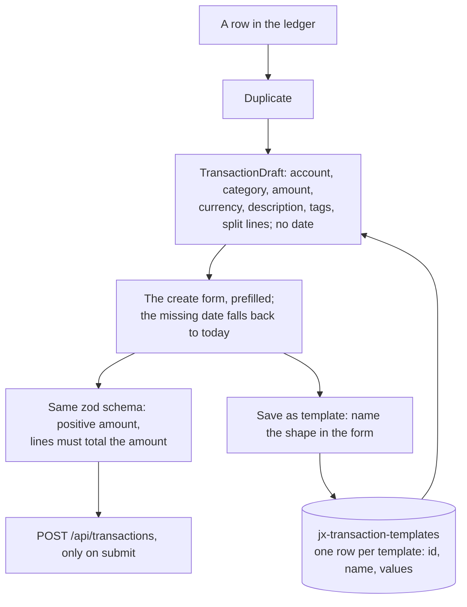

# Transactions

Back to the [feature walkthrough](README.md). See also [decisions](../decisions/transactions.md), [architecture: Transactions, imports and receipts](../architecture/transactions.md), [architecture: Frontend data, loading and tables](../architecture/frontend-data.md).

Backend `Transactions`, page `/transactions`. One `Filtered` method builds the query for the list, the summary, the CSV and the PDF, so the four cannot disagree.

A transaction also carries tags, which are described on their own page: [Tags](tags.md). They are part of the create and update bodies as `tagIds`, they come back on every transaction response, `tagIds` is a comma-separated filter on the same four endpoints, and `POST /api/transactions/bulk-tags` sets the whole set on a selection. Tags sit on the transaction and never on a split line.

A transaction can also carry up to ten files — a receipt photo, an invoice PDF — added and removed from its edit dialog and counted with a paperclip in the ledger; every transaction response carries `attachmentCount`. They follow the transaction's visibility, stay with it in the trash, and are described on their own page: [Attachments](attachments.md).

Since 2026-09-26 an expense far above what its payee or its category usually costs carries a stored verdict, checked by a background job once when the row is recorded and again after an edit to its amount, account, category, type, date, description or split. Every transaction response carries `unusual` and `unusualDismissed`, the ledger shows a rising-arrow badge beside the paperclip whose popover explains the verdict and marks the row "Not unusual" with undo, and `unusual=true` is a filter on the same four endpoints, offered as "Unusual only" in the amount column's filter and in the phone filters dialog. All of it is behind the `UnusualAmounts` switch and described on its own page: [Unusual amounts](unusual-amounts.md).

Since 2026-09-27 an expense can pay one of the signed-in user's debts that track payments. Rows of `GET /api/transactions` carry `debtPayment` (the link id, the debt id and the debt name) only for the owner of the link; a housemate who sees the same row on a shared account gets null. The ledger shows a small debt mark beside the badges that opens the debt's page, and the row actions offer "Link to debt" on an unlinked, unsplit expense when some debt tracks payments (a dialog with the debt, the kind and an optional principal from the statement) and "Unlink from debt" on a linked one. The row itself stays an ordinary expense everywhere. See [Debt amortization](debt-amortization.md#tracking-payments).

## Uncategorized rows and closed months

`uncategorized=true` is a filter on the same four endpoints, part of `TransactionFilterRequest` like every other, and belongs to no feature. It keeps a transaction with no category, and a split transaction with at least one line without one; a split whose lines all carry a category is categorized even though its own `CategoryId` is empty. The ledger offers it as "Uncategorized", right after "All categories" in the category column's filter and in the phone filters dialog; choosing it clears `categoryId` and choosing a category clears it, so the two never combine. It is the `uncategorized` search param, counts as an active filter, travels in the export links and in a saved filter, and a saved filter written before it parses without it. It arrived with [month-end close](month-end-close.md), whose checklist counts the month's uncategorized rows through the summary and links to the ledger with the month's dates and this filter, so the count and the list it opens agree.

While `MonthClose` is on, the create and edit dialogs of a transaction and a currency conversion show a hint under the date when that date falls in a month the user closed under the current household scope: "August 2026 is closed. Saving will show as a change after the close." `ClosedMonthHint` in `features/month-close` reads the year's statuses from `GET /api/month-close?year=`, which the `/close` route already caches, or fetches it quietly on demand with a one-minute stale time; a failure shows no hint. It is a hint only: saving is never blocked, and the change shows as drift on the month-end page. Every transaction, transfer, conversion and investment mutation also invalidates the `/api/month-close` queries, so the month's status and drift follow without a reload.

## Create with a split

## Bulk recategorize and bulk tagging

`POST /api/categorization-rules/run` is the third way a category or a tag arrives on a row that already exists, and it plays by stricter rules than either bulk operation: it only offers rows that carry no category at all, unless the caller explicitly asks to recategorize, it never touches a split transaction, and it adds tags without removing any. See [Categorization rules](categorization-rules.md).

`POST /api/transactions/bulk-tags` is the same operation for tags and replaces the whole set on every listed row. It differs in two ways: it accepts split rows, because a tag belongs to the payment rather than to a line, and it does not care whether the selection mixes income and expense, because a tag has no flow type. It is all or nothing in the same way: an invisible transaction answers 404, an invisible tag answers 400 `reference.notFound`, and nothing is written in either case.

## Saved filters

A saved filter is a name put on the filter half of the search params. It lives in the browser, in the `jx-saved-filters` TanStack DB local-storage collection, next to the preferences row; there is no table, no endpoint and nothing to invalidate. The menu sits in the page header beside the export menu, holds the whole list, and saves, renames, deletes and applies.

The page number and the row selection are never saved: the page number belongs to one reading of one list, and the selection is cleared by any navigation. Sorting is not saved either, so applying a saved filter never reorders the table under the reader; the sort the reader chose stays where it was.

Applying goes through `navigate` exactly as every filter control does, so the URL is the only state, the back button undoes an applied filter, and the link is still shareable. A name that points at a deleted category, account or tag is applied as stored rather than repaired: dropping the missing part would silently answer a wider list than the name promises, which is the one failure a filter must not have. The entry says so in the menu, and the ledger answers the empty list that the filter honestly describes.

## Templates and duplicate

Duplicate is one action on a row. It opens the ordinary create dialog filled from that row, with today's date, its tags ticked and its split lines copied, and it writes nothing until the form is submitted; the split lines arrive without their server ids, because they will be new lines of a new transaction.

A template stores the same shape under a name, minus the date, in `jx-transaction-templates`. It is saved from inside the create dialog, so a template can be composed from nothing or, with Duplicate first, from an existing row. The amount is normalized before it is stored, so a comma typed in the form becomes the canonical `12.50`.

Both paths reach the server through the create form and its schema, not through a second writer: a template whose amount was left empty opens a form that refuses to submit until an amount is typed, exactly like a blank one.
