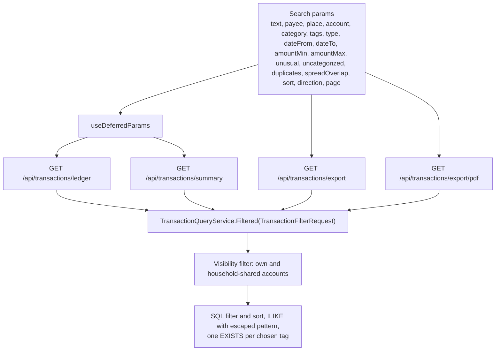
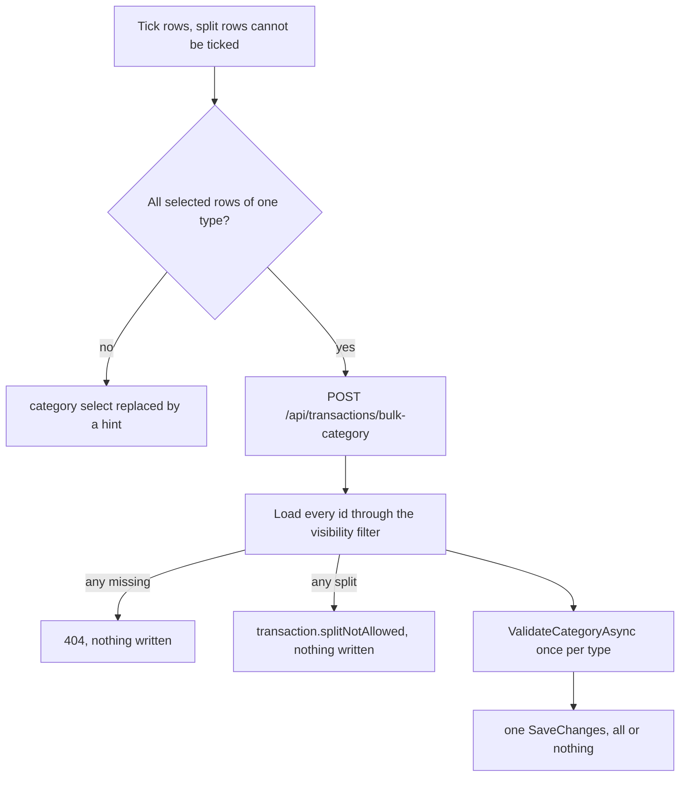
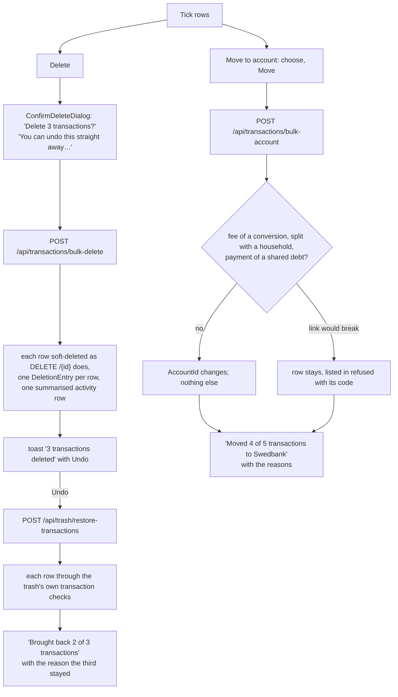
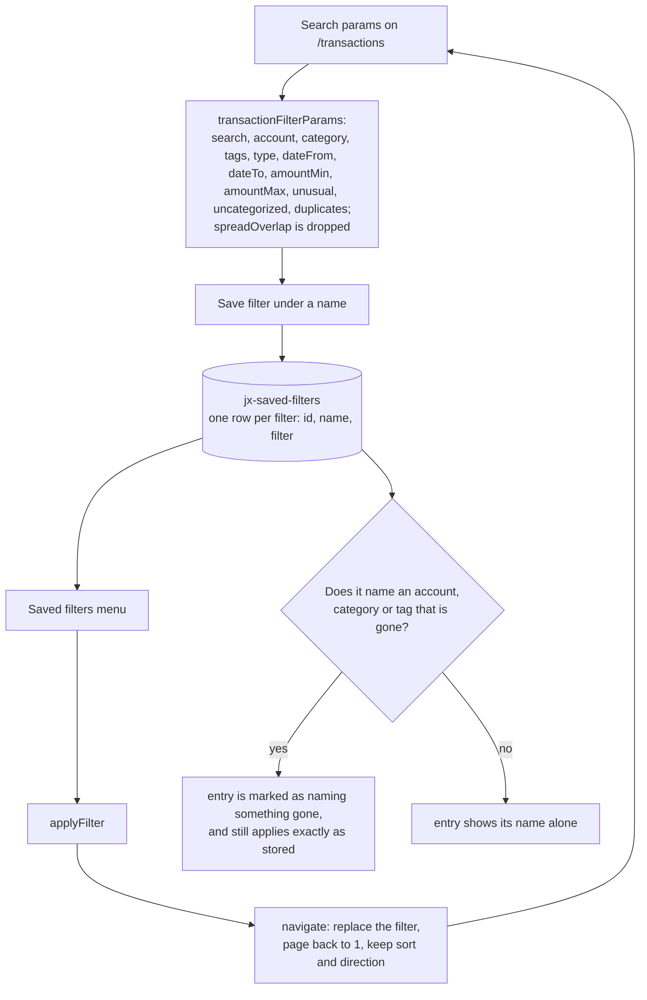
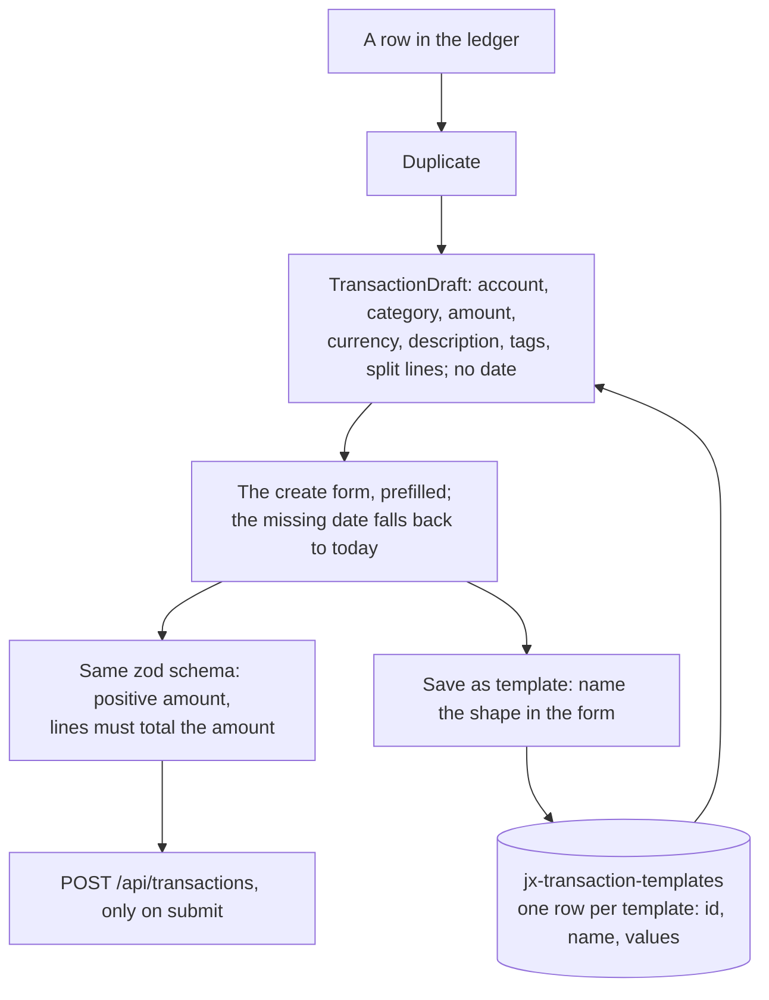

# Transactions

Back to the [feature walkthrough](README.md). See also [decisions](../decisions/transactions.md), [architecture: Transactions, imports and receipts](../architecture/transactions.md), [architecture: Frontend data, loading and tables](../architecture/frontend-data.md).

Backend `Transactions`, page `/transactions`. One `Filtered` method builds the query for the list, the summary, the CSV and the PDF, so the four cannot disagree. Since 2026-10-01 the page reads its rows from `GET /api/transactions/ledger`, which takes the same filters and folds the members of each of your [transaction groups](transaction-groups.md) into one item; `GET /api/transactions` stays the plain list that the dashboard and the import review read.

A transaction also carries tags, which are described on their own page: [Tags](tags.md). They are part of the create and update bodies as `tagIds`, they come back on every transaction response, `tagIds` is a comma-separated filter on the same four endpoints, and `POST /api/transactions/bulk-tags` sets the whole set on a selection. Tags sit on the transaction and never on a split line.

Every transaction response carries `version`, and since 2026-10-03 `PUT /api/transactions/{id}` requires the one the editor read: when someone else saved the row in the meantime, including a change to only its tags or split lines, the update answers 409 `conflict.stale` and writes nothing. The edit dialog then loads the transaction again, keeps what was typed and shows the message, so saving again goes through. A script with a [personal API token](personal-api-tokens.md#writing-with-a-token) reads the transaction first and sends its `version` the same way. See [Concurrent edits](../architecture/api-contract.md#concurrent-edits).

A transaction can also carry up to ten files — a receipt photo, an invoice PDF — added and removed from its edit dialog and counted with a paperclip in the ledger; every transaction response carries `attachmentCount`. They follow the transaction's visibility, stay with it in the trash, and are described on their own page: [Attachments](attachments.md).

When [receipt reading](receipt-reading.md) is on and Tesseract is installed, the form of an expense has "Fill from receipt" below the split switch: it reads one receipt photo or PDF on the server, shows the items grouped by category for review, and fills the form with split lines that add up exactly to the payment, or with one category when every item has the same one. In the add dialog it also fills the amount, currency, date and merchant and attaches the file once the transaction is saved; in the edit dialog it reads one of the transaction's files or a new one, which is attached first. Nothing is written until Save, so the split rules below apply unchanged.

Since 2026-09-26 an expense far above what its payee or its category usually costs carries a stored verdict, checked by a background job once when the row is recorded and again after an edit to its amount, account, category, type, date, description or split. Every transaction response carries `unusual` and `unusualDismissed`, the ledger shows a rising-arrow badge beside the paperclip whose popover explains the verdict and marks the row "Not unusual" with undo, and `unusual=true` is a filter on the same four endpoints, offered as "Unusual only" in the amount column's filter and in the phone filters dialog. All of it is behind the `UnusualAmounts` switch and described on its own page: [Unusual amounts](unusual-amounts.md).

Since 2026-09-27 an expense can pay one of the signed-in user's debts that track payments. Rows of `GET /api/transactions` carry `debtPayment` (the link id, the debt id and the debt name) only for the owner of the link; a housemate who sees the same row on a shared account gets null. The ledger shows a small debt mark beside the badges that opens the debt's page, and the row's actions menu offers "Link to debt" on an unlinked, unsplit expense when some debt tracks payments (a dialog with the debt, the kind and an optional principal from the statement) and "Unlink from debt" on a linked one. The row itself stays an ordinary expense everywhere. See [Debt amortization](debt-amortization.md#tracking-payments).

## Ledger items and groups

The ledger endpoint answers `items` whose `kind` is `transaction`, with the same `transaction` as the list, or `group`, with a `group` summary (`id`, `name`, `firstDate`, `lastDate`, `memberCount`, `matchingCount`, `netReportingAmount`, `scope`, `householdId`); the other part is null. Its `total` counts items, while the totals line above the table still counts transactions through the summary. A group appears when at least one member matches the filters, sorts by its newest matching member, the size of its net or its name, and follows every transaction when sorting by category or account. Every transaction response, from either endpoint, carries `groupId`, set only when the group is yours, and `enteredByMe`. The table renders a group as one row with a chevron that expands its members in place, the selection toolbar has **Group**, and a row's menu has **Add to group…** or **Remove from group**. The optimistic create and delete of `use-transaction-mutations.ts` add and remove a `transaction` item on the cached ledger page; a group's rows are refreshed by the refetch. Everything else is on [Transaction groups](transaction-groups.md).

## Refunds

Since 2026-09-29 a returned purchase is recorded as a refund: money back, in an expense category. A refund is an expense with a negative amount. `Type` stays `Expense`, and `Amount` and `ReportingAmount` are stored negative, so every total that sums expenses nets it without a line of its own: it lowers that category's spending, the month's expenses and the budget, and raises the account balance, while income stays what was earned. The API carries the same signed number: `amount` is negative for a refund, income stays positive, and the client reads a refund as `type === "expense" && amount < 0`. A refund is dated when the money came back, in the period it arrives in, and it is not capped at the purchase's amount, because shipping refunds, goodwill credits and currency differences exceed it legitimately.

The transaction form has a third choice beside Expense and Income: Refund. It takes a positive amount, which the form sends negated, shows the expense categories, and has no split switch, because a refund cannot be split (`transaction.splitNotAllowed`). Loading a negative expense, a template or a duplicate of one selects Refund with the positive amount.

An expense row with a positive amount has a "Record refund" action in its menu. It opens the create form as a refund with the same account, category (none for a split purchase), tags, currency and description, and the full amount, ready to lower. The description is the purchase's own rather than "Refund: …", so the refund carries the shop's payee key and nets in [spending by payee](reports.md#expense-by-payee) the same way it nets in the category. The refund is linked to the row through `refundOfTransactionId`, shown in the form as "Refund of {description}, {date}" with a button that unlinks it. The link is optional, one refund names at most one purchase, and a purchase may have several refunds. It must name an expense you can see that is not itself a refund and not the row itself, or the save answers `transaction.refundOriginalInvalid`; only a refund may carry it. It is checked when the refund is written, not when the purchase is edited later.

Since 2026-10-01 "Fill from receipt" with a return receipt fills the form the same way: type Refund, the category of the largest returned amount, the returned total and, when one is found, a link to the latest purchase from the same shop of at least that amount within 90 days, with its description. See [Receipt reading](receipt-reading.md#return-receipts).

In the ledger a refund's amount reads "+€12.00" in ink rather than the income colour, with a neutral "Refund" tag before it (in the desktop table the tag moves onto its own line above the amount when the two do not fit the column), and a linked refund shows "Refund of {description}, {date}", a link that opens the ledger searched for that description on that date. The purchase shows a "Refunded €12.00" tag, the reporting-currency total of the visible refunds that name it, carried by text and not by colour alone. `GET /api/transactions` and `GET /api/transactions/{id}` answer `refundOf` (`id`, `date`, `description`; null when the purchase is deleted or no longer visible) and `refundedAmount`. The ledger's type filter has no separate value for refunds: "Expense" lists them with their Refund tag. Sorting by amount sorts a refund by its negative reporting amount. A soft-deleted purchase hides the link, and the retention purge sets it to null through the foreign key's `SET NULL`.

The import review can record an incoming bank row as a refund, linked or not, and proposes one when the bank entry looks like money back for a purchase on that account; see [Bank statement import](bank-statement-import.md#refunds). A refund typed in by hand matches the bank's credit of the same size like any hand-entered row.

How each part of the application treats a refund. Totals net it, and the checks that look for unusual charges, subscriptions, price rises and loan payments ignore it, because a refund is not a charge:

| Place | Treats a refund |
| --- | --- |
| Account balance, `AccountMovements.SumAsync` and `ListAsync` | Raises it: `-Amount` of a negative expense is positive. Reconciliation (`ReconciliationService`) and the statement's ledger balance use the same movements |
| Ledger summary, `TransactionQueryService.GetSummaryAsync` | Nets the expense total; the totals line shows it with a minus, and with a plus when refunds outweigh the spending |
| Reports: totals, trend, category, tag and payee breakdowns (`ReportService`, `CategoryAttributionService`, `CategoryBreakdownBuilder`) | Nets. A category, tag or payee whose refunds exceed its spending keeps its negative net and sorts last. A payee's count includes its refunds |
| Payee ledger filter (`PayeeKey`) | Lists the refund when its description normalizes to the payee's key |
| Dashboard month totals, trend and category breakdown (`DashboardService`) | Nets |
| Budgets, `BudgetUsageCalculator` | `spent` is net in the refund's window; a rollover carries the difference. A refund never raises a budget notification, and one already raised stays |
| Budget limits from history, `BudgetSuggestionService` | Nets each window's spending, since it reads the same attributions |
| Month-end close, `MonthCloseService` | Snapshot totals and drift net it; a refund dated in a closed month is drift like any late edit |
| Monthly digest | Reads the month-close review, so its totals and category movers are net |
| Cash-flow forecast, `CashFlowForecastService` | Usual spending nets the refunds of the three months; the recurring entries' matching rows and variable estimates ignore them (through `RecurringHistory.LoadAsync`, which the bills calendar shares, so a refund never pays an occurrence) |
| CSV export | The amount column holds the signed amount with type `Expense`, so a spreadsheet sum of Expense rows is net spending |
| PDF export | Totals are net; the type cell reads "Refund" and the amount keeps its sign |
| Unusual amounts, `UnusualAmountService`, `UnusualAmountJob` | Ignored as history and as a candidate: the job marks a refund checked with no verdict, and an edit that makes a row a refund clears its verdict (`AppDbContext.ApplyEntityRules`) |
| Subscription detection, `SubscriptionDetectionService` | Ignored |
| Possible duplicates, `PossibleDuplicates.Pairs` | Never pairs: only rows above zero are compared, so two equal refunds are not offered as duplicates |
| Price rises, `PriceRiseMatcher` and the job's comparison | Ignored |
| Debt payments, `DebtService` | Never offered as a candidate; linking one answers `debt.paymentWrongType` |
| Rule suggestions, `SuggestedRuleService` | Ignored as evidence |
| Categorization rules, `RuleMatcher` | A rule with an amount range never matches a refund, because the range compares the signed amount; a rule without one can categorize an uncategorized refund like any expense |
| Validation | `amount` of an expense must be non-zero (`money.nonZero`); income and split lines stay positive (`money.positive`); an import row's `amount` stays positive, because it is the bank's size |
| Household settle-up, `SettleUpService` | A refund cannot be split with a household (`settleUp.notExpense`); money a housemate pays back can be recorded as a refund of the split expense |

## Splitting with the household

Since 2026-09-29 a purchase on an account the signed-in member owns has "Split with household" among its row actions while the member belongs to a household and `Households` is on; it opens the split dialog of [Household settle-up](household-settle-up.md). This is a different thing from a split transaction: split lines divide one payment between categories, a household split divides it between people, and the two combine. `GET /api/transactions` answers `sharedExpense` on a split row for the payer only, in its own batched query beside the debt payment marker: the split's id, household, method, shares, the payer's own share and `amountDiffers`, true when the transaction's amount no longer equals the split's copy. The ledger shows it as a people icon whose accessible name is "Split with Home, your share €30.00", and, when the amount differs, an "Update split" button that opens the dialog prefilled; on an already split row the row action reads "Edit split". Another member who sees the row on a shared account gets no marker.

Since 2026-10-01 the same purchase also offers "Split with a person" while the member has at least one person in the People section of the Households page, for a friend outside the household; it opens the split dialog of [Money with people outside the household](money-with-people.md#splitting-a-purchase-with-people). A row is split once: a row split with a household offers only the household split and a row split with people only "Edit split with people". The row answers `contactSplit` for its owner, the split's id, method, the member's own part and each person's share, loaded by `ContactSplitMarks` in one batched query; there is no ledger mark.

The row menus only list these actions. "Link to debt" and the household split each open one dialog that the page owns, with the row as its target, as the edit dialog does: `useDebtPaymentLinks` and `useSharedExpenseSplits` load the debts, the households, the accounts and `me` once per page and answer `actionFor(transaction)`, and `useTransactionRowDialogs` joins them for the table and the phone list. The "Update split" button of the people mark opens the same split dialog.

## Active filters and the header

While a column filter is active its button names the value in its tooltip and accessible name, such as "Filter by Account (now: Swedbank einamoji)", besides the tint. Above the rows, one line lists every active filter as a removable chip, labelled with its column, and ends with "Clear filters", which keeps the sort. A date range that covers exactly one calendar month reads as the month, such as "September 2026"; otherwise it reads as a range, or "From" or "Until" one date. The search text is quoted, the payee chip shows the key it filters on, and the category chip can read "Uncategorized". The phone filters dialog writes the same search params, so the line shows on phones too. It replaced the "Clear filters" button that sat in the page header. The page calls `useTransactionFilters` once and passes the result to the chip line, the column headers, the phone filters dialog and the saved filters menu; `useFilterSummaries(filters, tags)` builds the chip texts, and the column buttons read the same texts.

The filter half of the search params is one zod schema, `transactionFilterSchema` in `lib/transaction-filter.ts`. The route's `transactionsSearchSchema` extends it with `page`, `sort`, `direction` and `new`; `transactionFilterParams` parses a view through it, which keeps only the filter keys; and a saved filter stores the same shape. Each field falls back to "not set" on its own, so a URL or a saved filter with one bad value keeps the rest: `accountId` and `categoryId` must be UUIDs, `tagIds` a comma-separated list of them, `dateFrom` and `dateTo` ISO dates such as `2026-09-01`, `amountMin` and `amountMax` non-negative numbers, and `unusual`, `uncategorized` and `duplicates` only take `true`, so `unusual=false` reads as no filter.

The create and edit dialogs, with the prefill of a duplicate, a refund or a template, the receipt file waiting to be attached and the receipt split that moves to an existing row, live in `useTransactionFormSection`; the page calls it once and hands its `startBlank`, `startFromDraft` and `startEditing` to the header, the templates menu and the row actions.

While the `Import` switch is on, the header also holds "Import bank statement" beside "Add transaction"; it opens the dialog described in [Bank statement import](bank-statement-import.md).

In the transaction form, Type is an Expense / Income / Refund segmented control, and Category, like the category of each split line, is a searchable combobox. Changing the type empties the category and every split line's category that is not of the new type, since the pickers only offer categories of the type and the server refuses the other with `category.wrongType`.

When a filter leaves no rows, the empty table and the phone list say so and offer "Clear filters", which runs the same reset as the chip line. Without an account the page says so and links to the accounts page with the create dialog open. Below the rows, the pager shows the range and the total, such as "51–100 of 438", and from five pages on a page number field, where typing a number and Enter jumps to it, clamped to the last page. A page past the last one, from a link such as `?page=999` or after deleting the only row of the last page, moves to the last real page through `usePageClamp`, replacing the history entry rather than adding one.

## The desktop table

Since 2026-10-02 the desktop table has at most seven columns: the tick box, Date, Description, Category, Account from the `xl` breakpoint (1280px), Amount and the row actions. The description takes the width the others leave and never gets less than 240px; below that the table scrolls sideways inside its own region. A row's tags sit as chips under its description, on the muted line that also holds the account name below `xl` and the bank's statement text when a payee name replaced it; from `xl` the account has its own column again. `useWideLedger`, a `matchMedia` subscription read through `useSyncExternalStore`, makes that choice once, so the columns, the span of a group row and the pending skeleton (`TransactionsTableSkeleton`) always agree. Every transaction row has at least Duplicate, Edit and Delete, so its actions are always one vertical-ellipsis menu; the column is two icon buttons wide because a group row shows Rename and Ungroup side by side. The Description header's filter holds the search text, the place while the `Locations` switch is on, and the tags, and its button names all three. A group row's date range breaks between its two dates rather than running into the group's name.

## Changing one row's category

On the desktop table the category cell of an unsplit row is a borderless combobox, with the category icon beside it, listing the categories of the row's type plus "Uncategorized"; its popup opens with a search box, so a click, a few letters and Enter file the row. Choosing one posts `POST /api/transactions/bulk-category` with that single id, so the same rules as bulk recategorizing apply, and the cell shows the choice while the request runs. No success toast is shown, so a run of rows can be categorized one after another; a failure toasts as usual and the refetch puts the old value back. Split rows keep the "Split" tag, a row still being saved keeps plain text, and the phone list keeps the full dialog. The cells share one `useInlineCategory` on the page: one bulk-category mutation whose success offers the suggested rule, and the choices still in flight read with `useMutationState`, so each cell shows its own choice while its request runs even when several run at once, and rows recategorized from the selection toolbar show theirs the same way.

A save that sets or changes a category, in this cell or in the transaction form's create and edit, then asks whether the row completed a suggested rule. When it is the third row of one payee filed by hand under one category, a toast asks "Always categorize descriptions starting with "MAXIMA" as Groceries?" with **Create rule** and **Don't ask again**; it comes once, and only while categorization rules are switched on. See [Categorization rules](categorization-rules.md#suggested-rules).

## Uncategorized rows and closed months

`uncategorized=true` is a filter on the same four endpoints, part of `TransactionFilterRequest` like every other, and belongs to no feature. It keeps a transaction with no category, and a split transaction with at least one line without one; a split whose lines all carry a category is categorized even though its own `CategoryId` is empty. The ledger offers it as "Uncategorized", right after "All categories" in the category column's filter and in the phone filters dialog; choosing it clears `categoryId` and choosing a category clears it, so the two never combine. The filter's "Uncategorized" option and the "Uncategorized" choice of the category cell and the selection toolbar use one option value, `UNCATEGORIZED_OPTION`; the filter turns it into `uncategorized=true` and the other two into a null category. It is the `uncategorized` search param, counts as an active filter, travels in the export links and in a saved filter, and a saved filter written before it parses without it. It arrived with [month-end close](month-end-close.md), whose checklist counts the month's uncategorized rows through the summary and links to the ledger with the month's dates and this filter, so the count and the list it opens agree.

While `MonthClose` is on, the create and edit dialogs of a transaction and a currency conversion show a hint under the date when that date falls in a month the user closed under the current household scope: "August 2026 is closed. Saving will show as a change after the close." `ClosedMonthHint` in `components/closed-month-hint` reads the year's statuses from `GET /api/month-close?year=`, fetched quietly on demand with a one-minute stale time; a failure shows no hint. It is a hint only: saving is never blocked, and the change shows as drift when the dashboard shows that month. Every transaction, transfer, conversion and investment mutation also invalidates the `/api/month-close` queries, so the month's status and drift follow without a reload.

## Possible duplicates

Since 2026-10-01 the ledger can show the rows that may have been recorded twice: a card payment typed in by hand and later imported without being matched, a row added through a [personal API token](personal-api-tokens.md) and then imported, or one statement imported once as CSV and once as camt.053. `duplicates=true` is a filter on the same four endpoints and on the ledger, part of `TransactionFilterRequest` like `uncategorized`, and belongs to no feature switch.

A row is a possible duplicate when another visible, not deleted row (`PossibleDuplicates.Pairs` in `Transactions/Services`):

- is on the same account, of the same type, with the same amount and currency;
- is dated at most three days before or after it (`PossibleDuplicates.WindowDays`, the window of the import's [hand-entered match](bank-statement-import.md#entries-you-already-made-by-hand));
- has the same stored `PayeeKey`, or, when either row has no payee key, the same description once trimmed;
- is not a refund: rows with an amount of zero or below never pair;
- was not imported together with it: two rows imported by one confirm carry the same `CreatedAt`, which is how a statement that really lists two equal coffees on one day keeps both without being asked;
- was not already answered with "Keep both" for this pair.

Split rows pair like any other, by their total, because a split typed in by hand and the bank's unsplit row are exactly the case to catch. Transfers are rows of their own and never pair, and neither does a row with its partner on another account. The query is one `EXISTS` per row over a self-join of `Transactions` on `AccountId` and a date range, so the second side is read through the `(AccountId, Date)` index that serves the account filter; no index was added.

The ledger offers it as "Possible duplicates only", beside "Unusual only" in the amount column's filter and in the phone filters dialog. It is the `duplicates` search param, counts as an active filter with a chip under the amount label, travels in both export links and in a saved filter, and a saved filter written before it parses without it. While it is on, every row's actions menu adds **Keep both**, which posts `POST /api/transactions/{id}/duplicates/keep`: the server stores a `DuplicateDismissal` for every pair the filter currently finds with that row, both rows leave the list unless one still pairs with a third, and a toast says the pair will not be offered again. The other answer is the ordinary **Delete** of the same menu, with its confirmation and its undo toast; the partner left alone leaves the list, and restoring the deleted row from the trash brings the pair back. A kept pair follows the rows' visibility rather than the person: a household member who keeps a pair on a shared account keeps it for everyone who sees that account. The [month-end close](month-end-close.md#the-review) counts the month's possible duplicates and links here with the month's dates and this filter.

`PossibleDuplicateTests` cover a typed row and an imported one paired across three days while a fourth day, another amount, another type and another account are not, the summary and the CSV following the list, rows without a payee key paired by their trimmed description, refunds and rows imported by one confirm left out, Keep both storing one pair and answering 204 again with nothing left, 404 for a row the caller cannot see, a delete ending the pair and a restore bringing it back, and a pair kept by one household member gone for the other. `PossibleDuplicatesQueryTests` check in SQL that the pairs are read on the account with the three-day range, the payee key, the trimmed description and the kept pairs, `RetentionJobTests` that a purged transaction takes its kept pair with it, and `MonthCloseTests` that the checklist count equals the filtered summary. On the client, the transactions page story `KeepingBothPossibleDuplicates` and the checklist story `WithPossibleDuplicates` cover the filter chip, the menu action and the link.

## Payee filter

`payee` is a filter on the same four endpoints, part of `TransactionFilterRequest`, and belongs to no feature. The server normalizes the value with `SubscriptionDescription.Normalize` and keeps the rows whose stored `PayeeKey` equals it, so a key from the report and a pasted description such as "MAXIMA LT, UAB 4412" find the same rows; a value with nothing left after normalizing filters nothing, and more than 500 characters is refused with `text.tooLong`. It is how a row of "Expense by payee" on the reports page opens the ledger, together with `type=expense` and the range, so the list, the totals and both exports agree with the report's amount; see [Reports](reports.md#expense-by-payee). Unlike `search`, which is `ILIKE` on the raw text, it ignores punctuation and reference numbers. The filters dialog has no field for it, because it is reached from the report: it is the `payee` search param, counts as an active filter, shows as a removable "Payee" chip, travels in the export links and in a saved filter, and a saved filter written before it parses without it.

## Notes

Since 2026-09-30 a transaction carries `Note` beside `Description`: up to 1000 characters of the member's own words, such as "Tom's birthday gift", where the description holds what the bank printed. Create and update bodies take `note`, trimmed and stored as null when blank; an update replaces it like every other field, so an update without it clears it. Nothing else writes it: an import fills only the description of the rows it adds, and linking a statement row to a hand-entered transaction keeps the note with the rest of that transaction. The `search` filter matches the note as well as the description, both `ILIKE`, so the ledger's search placeholder reads "Search description or note". The CSV has a `Note` column at the end, which the member export's `transactions.csv` shares, the PDF leaves it out, and an edit to it is a visible field in the household activity log.

The transaction form has a Note field under the description, with the hint "Your own words, kept beside the bank's description. Imports never change it.". Since the same day a row whose payee the member named reads that name instead of the description, with the bank's text in the tooltip, and `search` matches the name too; see [Payee names](payee-names.md). The desktop ledger shows the note as a muted line under the description, cut to one line with the whole text in its tooltip, and the phone list shows it under the name. Duplicate copies the note with the rest of the row; a template leaves it out, because a template is a shape and a note is about one payment.

Since 2026-10-01 a row imported from a statement that names its counterparty also carries `payee`, read-only: without a payee name the ledger shows it as the row's name with the description in a muted line under it, `search` matches it, and the edit form shows it under the description. See [The statement's payee](bank-statement-import.md#the-statements-payee).

## Places

Since 2026-10-01, while the `Locations` switch is on, a transaction can carry `place`, up to 120 characters of the member's own, such as "Maxima, Ozo g. 18, Vilnius", and `latitude` and `longitude`, which come together, within range and are kept to five decimals, or `transaction.locationInvalid`. Create and update bodies take all three, through the browser and a read-and-write [token](personal-api-tokens.md#writing-with-a-token) alike; an update replaces them like every other field while the switch is on, and keeps the stored values while it is off. The form has a Place field under the note with suggestions of earlier places and, over HTTPS, **Use my location**; `search` matches the place too, and `place` is a substring filter on the same four endpoints, under the Description column's filter on the desktop and in the phone filters dialog, with a "Place" chip. The table gains no column. Duplicate and Record refund copy the place but not the coordinates, and a template keeps the place. The CSV has a `Place` column after `Spread months`, and a change of the place, not of the coordinates, is a visible field ("place") in the household activity log. Everything about it, receipts and the map included, is on [Transaction locations](transaction-locations.md).

## Receipt items in the search

Since 2026-10-01, while the `ReceiptReading` switch is on, `search` also matches the item names of the caller's own readings of the receipts attached to a row, so "vacuum" or "dyson" finds the purchase without remembering the shop. The list, the summary, the group members and both exports follow it, because it is part of the shared filter. A row found that way shows "Receipt item: DYSON V8 dulkių siurblys · warranty until Sep 12, 2028" as a muted line under the description and note, on the desktop table and the phone list, from the response's `receiptItem`; the table gains no column and the line carries no amount. How the items are matched and how long they stay searchable is on [Receipt reading](receipt-reading.md#finding-a-purchase-by-item).

## Spreading over months

Since 2026-09-30 an expense or income can be spread over months, and since 2026-10-02 a split or a refund too: `SpreadMonths` from 2 to 36, or null for an ordinary row. Yearly car insurance of €360 paid on 15 January and spread over 12 months counts €30 in each month from January to December in reports and budgets, while the ledger, the account balance and everything else about the money that moved still see one row of €360 on 15 January. The slices start with the payment's month, fall on the same day of each following month (clamped to the month's last day, so 31 January goes to 28 or 29 February), and divide `ReportingAmount` into cents by largest remainder, so they add up to the cent and differ by at most one: €100 over 3 months is 33.34, 33.33 and 33.33. Since 2026-10-02 `SpreadDirection` says where the months lie: `forward`, the default, starts with the payment's month as above, and `backward`, for a bill paid in arrears, ends with it, so a quarterly water bill of €90 paid on 10 April counts €30 in each of February, March and April. A backward slice falls on the payment's day of each earlier month, clamped the same way, and the leftover cents still go to the earliest months. A split row's slice is divided among its lines each month, in proportion to their amounts with the last line taking the remainder, the way a whole split row is divided on its date, so each line's category counts its share in every month and a month's categories still add up to its total. A refund is cut by the size of its amount and its slices keep the minus, so a refund of €100 over 3 months is −33.34, −33.33 and −33.33 and lowers its category in each of the three months. The server stores the dates of the first and the last slice, `SpreadFrom` and `SpreadUntil`, beside the months; see [architecture](../architecture/transactions.md#spread-rows).

Create and update bodies take `spreadMonths` and `spreadDirection`; an update replaces both like every other field, so an update without `spreadMonths` stops the spreading and one without `spreadDirection` spreads forward. Outside 2 to 36 it is refused with `range.invalid`; before 2026-10-02 a split was refused with `transaction.splitNotAllowed` and a refund with `transaction.spreadRefund`, a code that no longer exists. Every transaction response carries `spreadMonths`, `spreadDirection` (null when the row is not spread), `spreadFrom` and `spreadUntil`. The CSV has a `Spread months` column after `Note`, which the member export's `transactions.csv` shares and which leaves the direction out, the PDF prints "Spread over 12 months" under the description, or "Spread over the 12 months up to this one" for a backward spread, and a change to either is a visible field ("spread over months", "months a spread counts in") in the household activity log. A [recurring entry](recurring-bills.md) can carry the same choice, direction included, and writes spread transactions when it is confirmed. Since 2026-10-02 the [import review](bank-statement-import.md#spreading-a-row-over-months) offers it too, with the 3, 6 and 12 month presets.

These count each slice in its month: the report's totals, trend and category, tag and payee breakdowns (a spread row counts once in a payee's `count` for every period its slices touch), the year review, the dashboard's summary, trend, category and spending-pace cards, category and tag budgets (shared ones and limits from history included), the month-end close and the monthly digest. These see the whole row on its date, because they are about the money that moved: the account balance and reconciliation, the cash-flow forecast, unusual amounts and subscription detection, debt payments, household settle-up, the receipt items report and the ledger's own totals.

The transaction form has a "Spread over" select under the date with Off, 3, 6 and 12 months and Custom, which shows a Months field that takes 2 to 36, and once a spread is chosen a "Months counted" select with "From the date's month on" and "Up to the date's month". Since 2026-10-02 it stays for a refund and while the split switch is on. Duplicate copies both, Record refund does not, so a refund of a spread purchase counts in the month the money came back unless it is spread itself, and a template keeps both. The ledger shows the chip "Spread · 12 months" beside the refund mark, on the phone under the name; its tooltip reads "Counts €30.00 a month in reports and budgets, January 2026 to December 2026", naming the first and the last month whichever way the row is spread, and when the ledger is filtered by a date range it adds how much of the row falls inside the range. `lib/spread-slices.ts` repeats the server's cut for that, and the amounts go through the same formatters as every other amount, so privacy mode masks them.

### Drill-through

A figure that counts slices still leads to its rows. `spreadOverlap=true` on the four endpoints of `TransactionFilterRequest` keeps, besides the rows dated in the range, the spread rows whose `SpreadFrom` is before its end and whose `SpreadUntil` reaches its start, so a category, tag or budget link for March lists the January insurance row, and the April water bill spread backwards; the chip's tooltip says how much of it belongs to March. The ledger's own total is still a sum of whole rows, as for tags and splits. The server ignores the flag unless both `dateFrom` and `dateTo` are set. On the client it lives only in the URL: `TransactionsLink` adds it whenever its filter carries both dates, and the money flow's category links add it too; it shows no active-filter chip, changing or removing the date filter clears it, and saved filters leave it out, because it describes where a link came from rather than what the reader wants to keep.

`SpreadSlicesTests` and `lib/spread-slices.test.ts` run the same cases on both sides (sums, a cent at most between slices, 0.10 over 12 months, 31 January in leap and ordinary years, 36 months, the end date), and `AppDbContextTests` covers `SpreadUntil` on insert, on a change of date or months and when the months are cleared. The integration tests are `SpreadReportTests` (a month and a year, totals equal to the categories, the dashboard and report trends, tag and payee breakdowns), `SpreadBudgetTests` (category, tag, rollover and household-shared budgets), `SpreadTransactionTests` (the ledger summary, balance and forecast, the drill-through flag, validation, revaluation, the active household, the trash, debt payments and settle-up), `SpreadMonthCloseTests`, `SpreadRecurringBillTests` and a round trip in `UserImportTests`.

## Amount range filter

`amountMin` and `amountMax` are filters on the same four endpoints, part of `TransactionFilterRequest`, and belong to no feature; they arrived on 2026-09-30. Each is inclusive and optional, so one bound alone filters from that side. They compare the size of the amount in the transaction's own currency, `abs(Amount)`, not the reporting amount: "that €49 charge" is the number printed on the statement, and a refund of €49 is found beside the purchase of €49. Each bound must be a non-negative amount with at most two decimals (`money.nonNegative`), and `amountMax` below `amountMin` is refused with `range.invalid`.

The ledger offers them as "Amount range" with a From and a To field in the amount column's filter, under the type select, and in the phone filters dialog. Both fields accept a comma or a dot, mark text that is not an amount with `aria-invalid`, and `parseAmountRange` in `transaction-filter-fields.ts` drops such text and swaps bounds typed the wrong way round, so the ledger never sends a request the server refuses. The column filter applies with its Apply button; the phone dialog applies when a field loses focus. They are the `amountMin` and `amountMax` search params, stored as numbers, count as one active filter, show as one removable "Amount range" chip that reads "45.00 – 50.00", "At least 100.00" or "At most 20.00" without a currency sign, travel in the export links and in a saved filter, and a saved filter written before them parses without them.

## Create with a split

```mermaid
sequenceDiagram
    actor User
    participant Form as TransactionForm
    participant Client as customFetch
    participant Api as POST /api/transactions
    participant Rates as ExchangeRateService
    User->>Form: amount 12,50, currency, category or split lines
    Form->>Form: zod: lines must total the amount
    Form->>Client: optimistic row added to the cached list
    Client->>Client: decimal fields normalized to 12.50
    Client->>Api: request
    Api->>Api: account visible, category of the right type, currency usable
    Api->>Rates: rate for the transaction date
    Rates-->>Api: ReportingAmount frozen for that date
    Api->>Api: lines share ReportingAmount in proportion, last line takes the remainder
    Api-->>Client: 201
    Client->>Client: invalidate ledger roots: transactions, accounts, dashboard, reports, budgets, net worth
    Note over Form: failure keeps the dialog open with values,<br/>field errors land on their fields
```

Split lines come back in the order they were sent, on create, update, get by id and the list, and after a restore from the trash: each line stores its place in the request as `Position`, which is not part of the contract, and every read orders by it then by `Id`. Reordering the lines in an edit is therefore kept, the Beancount journal writes the postings in that order, and the line that takes the remainder when category figures share out the reporting amount is the last one entered.

While the split is on and the amount is a valid positive number, a line above the split lines reads "Transaction €75.00 · Assigned €52.00" followed by "€23.00 remaining", "€5.00 over" in the expense colour, or "Fully assigned". `splitBalance` in `line-form-value.ts` counts only line amounts that parse as money and works in cents. A line whose amount is empty offers "Use remaining €23.00", which types the remainder into it. The zod rule that the lines must total the amount is unchanged; the line only shows the gap before submit. The description and every line's description take at most 500 characters, the generated `createTransactionBodyDescriptionMax`; the server's limit on a line's description is not in the contract, so the form and the receipt split reuse the transaction's.

## Suggested categories

While the `LearnedCategories` switch is on, the form offers a category when the description field loses focus with no category chosen, on an expense or income that is not split and not a refund: a chip under the category reads "Suggested: Groceries" with "by rule "Maxima"" or "93% sure", and one click sets the category. With the Uncategorized filter on, the toolbar's **Suggest categories** lists up to 200 of the filtered rows grouped by suggested category, and **Apply** files the ticked groups through `bulk-category` with `onlyUncategorized`, so a row categorized meanwhile keeps its category. A rule always wins over the model. See [Learned categories](learned-categories.md).

## Bulk recategorize and bulk tagging

`onlyUncategorized: true` on `POST /api/transactions/bulk-category` leaves every listed row that already has a category as it is and counts only the rows it changed in `updated`; the other checks still cover every listed row. The ledger's [suggested categories](#suggested-categories) apply with it.

`POST /api/categorization-rules/run` is the third way a category or a tag arrives on a row that already exists, and it plays by stricter rules than either bulk operation: it only offers rows that carry no category at all, unless the caller explicitly asks to recategorize, it never touches a split transaction, and it adds tags without removing any. See [Categorization rules](categorization-rules.md).

`POST /api/transactions/bulk-tags` is the same operation for tags and replaces the whole set on every listed row. It differs in two ways: it accepts split rows, because a tag belongs to the payment rather than to a line, and it does not care whether the selection mixes income and expense, because a tag has no flow type. It is all or nothing in the same way: an invisible transaction answers 404, an invisible tag answers 400 `reference.notFound`, and nothing is written in either case.

## Deleting a selection and moving it to another account

Since 2026-10-01 the selection toolbar also has **Move to account**, which offers an account select, the hint "Each row keeps its amount, currency, date, category and tags." and a **Move** button, and **Delete**, an outline button in expense red. Neither cares whether the selection mixes income and expense. The selection itself is unchanged: split rows and the members of an expanded group cannot be ticked, as for the other bulk actions, although both endpoints accept them like any other row, so a client of the API can delete or move them.

Only one bulk action runs at a time. While Set category, Set tags, Move or Delete is waiting for the server, that button shows its spinner (More shows it too for Set tags and Move) and every other action in the toolbar, Clear selection included, is disabled, so a second click cannot start a move of rows that are being deleted or recategorize rows that are being moved.

Since 2026-10-02 the totals line and the selection toolbar share one slot, a one-cell grid holding both with the one not in use invisible, so ticking the first row never moves the table; from a content width of 1024px each fits on one line. The toolbar shows the count, the category select with **Set category** (a two-line hint takes their place while the selection mixes income and expense), **More**, **Delete** and **Clear selection**. More is a menu of **Set tags**, **Move to account** and **Group**, which needs two rows; Set tags and Move to account each open a small dialog with the tag picker or the account select, Cancel and the action, and the dialog closes when the action succeeds and the selection clears.

Shift-clicking a checkbox, or pressing Shift+Space on it, ticks or clears every selectable row of the page between it and the checkbox used last, to the state the clicked one takes. The selection survives a change of sort, but the count and every bulk action cover only the ticked rows on the page in view: a ticked row that a new sort moves off the page leaves the count, and comes back ticked if a later sort brings it back. Moving to another page with the pager, changing a filter, finishing a bulk action or Clear selection clears it.

`POST /api/transactions/bulk-delete` takes `transactionIds`, 1 to 200 (`required`, `collection.invalidSize`), and is all or nothing on visibility like the other bulk operations: one invisible id answers 404 and nothing is deleted. Otherwise every row is deleted exactly as a single delete does it, in one save: its split lines, tags and files stay, its debt payment link, household split and group membership are left alone and stop counting while it is deleted, as they do for one row, and each row gets its own trash entry, so each is listed in the trash and restorable on its own for 30 days. The answer is `{ deleted }`. The undo is `POST /api/trash/restore-transactions` with the same ids, which restores each row through the same checks as `POST /api/trash/restore` and answers `{ restored, refused }`; see [Trash and undo](trash-and-undo.md#undoing-a-selection).

`POST /api/transactions/bulk-account` takes `transactionIds` and `accountId`. The account must be visible to the caller (400 `reference.notFound`) and every row too (404), or nothing moves. A move changes `AccountId` and nothing else, which is what the transaction form allows when the account is changed: the amount, its currency, the date and therefore `ReportingAmount` stay, so there is no revaluation and no currency check, because an account holds balances in any currency and the row's currency is already in use. The category, split lines, tags, files, refund link (a refund may name a purchase on any account), group, note, place and import reference stay too; an imported row keeps its reference, so the account it moved to treats the same statement line as a duplicate, which is what correcting a statement imported into the wrong account needs. A row already on the account is left alone and not counted in `moved`. Three links refuse a row, which then stays where it is and is listed in `refused` as `{ transactionId, code, reason }`:

| The row is | Refused when | Code |
| --- | --- | --- |
| the fee of a currency conversion | always: the fee stays on the conversion's account, which a conversion edit keeps updating in place | `transaction.conversionFee` |
| an expense split with a household | the member who paid it does not own the account, the rule a split is created under | `settleUp.notPayer` |
| a payment of a debt shared with a household | the account is not shared with that household, the rule a shared debt's payment is linked under | `household.referenceNotShared` |

The page clears the selection after either action and shows one toast: "5 transactions moved to Swedbank", or a warning "Moved 4 of 5 transactions to Swedbank" whose description lists each distinct reason once in the reader's language (`refusalReasons` in `transactions-page/bulk-refusals.ts`). The row is updated through the change tracker, so `UpdatedAt` is stamped and a row dated in a closed month shows as an edit in that month's [drift](month-end-close.md#what-drift-covers-and-what-it-does-not); the unusual-amount check runs again for it, as after an account change in the form. On shared accounts each operation writes one row in the household [activity log](audit-log.md#imports-and-bulk-edits) instead of one per transaction: `Selection deleted, 3 transactions`, `Selection restored, 3 transactions` and `Moved to Swedbank, 3 transactions`, the last in the households of both the old and the new accounts. None of the three is token-writable: a read-and-write API token gets 403 `token.notAllowed` from them, as from every other route outside the [write list](personal-api-tokens.md#writing-with-a-token).

`BulkDeleteAndMoveTests` covers a selection with a split row deleted with one trash entry per row and restored whole in one call, twice; one row of it restored on its own; an invisible row refusing the delete; an undo that restores one row, refuses one whose account was archived and one that was never deleted; a move keeping the currency, reporting amount, category and tags and leaving a row already there uncounted; an invisible account or row and 201 ids refused; a conversion fee, a household split and a shared debt payment refused; and one activity row each for a move, a delete and an undo on shared accounts. `MonthCloseTests` checks that a moved row is an edit and a deleted one a deletion in a closed month. On the client, `bulk-refusals.test.ts` covers the reasons, the `SelectionToolbar` stories `MovingToAnotherAccount`, `DeletingTheSelection`, `MovePending` and `DeletePending` the toolbar, and the page stories `MovingSelectedRowsWithARefusal` and `DeletingSelectedRowsAndUndoingWithARefusal` the toasts with a partial refusal.

## Saved filters

A saved filter is a name put on the filter half of the search params. It lives in the browser, in the `jx-saved-filters` TanStack DB local-storage collection of `features/transactions/transaction-views.ts`, next to the preferences row; there is no table, no endpoint and nothing to invalidate. The menu sits in the page header beside the export menu, holds the whole list, and saves, renames, deletes and applies. Deleting a saved filter or a template asks first in a confirmation that names it, because a browser-side list has no trash and no undo.

The page number and the row selection are never saved: the page number belongs to one reading of one list, and the selection is cleared when the filter or the page changes. Sorting is not saved either, so applying a saved filter never reorders the table under the reader; the sort the reader chose stays where it was.

Applying goes through `navigate` exactly as every filter control does, so the URL is the only state, the back button undoes an applied filter, and the link is still shareable. A name that points at a deleted category, account or tag is applied as stored rather than repaired: dropping the missing part would silently answer a wider list than the name promises, which is the one failure a filter must not have. The entry says so in the menu, and the ledger answers the empty list that the filter honestly describes.

## Templates and duplicate

Duplicate is one action on a row. It opens the ordinary create dialog filled from that row, with today's date, its tags ticked and its split lines copied, and it writes nothing until the form is submitted; the split lines arrive without their server ids, because they will be new lines of a new transaction.

A template stores the same shape under a name, minus the date, in `jx-transaction-templates`. It is saved from inside the create dialog, so a template can be composed from nothing or, with Duplicate first, from an existing row. The amount is normalized before it is stored, so a comma typed in the form becomes the canonical `12.50`.

The command palette's [quick add](interface.md#command-palette) is a third way into the same dialog: `12.50 maxima` opens it filled in with an expense for today, the account this browser last saved a transaction on and the category from a rule, the recall or a learned guess, and nothing is written until Save.

All of them reach the server through the create form and its schema, not through a second writer: a template whose amount was left empty opens a form that refuses to submit until an amount is typed, exactly like a blank one.
