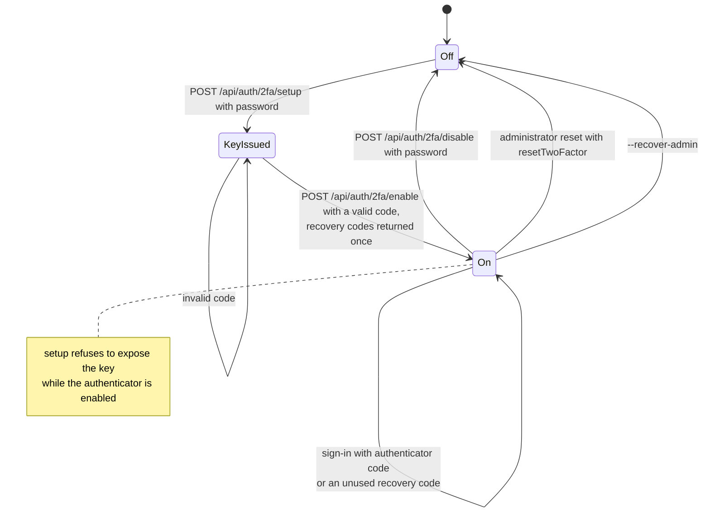

# Two-factor authentication

Back to the [feature walkthrough](README.md). See also [architecture: Authentication](../architecture/authentication.md).

Backend `Auth/TwoFactor`. Setup and disable require the current password, which counts toward the lockout.

## Passkeys and the code step

[Passkeys](passkeys.md) are independent of the authenticator. A user-verified passkey is a whole sign-in, so a member with two-factor authentication on who signs in with a passkey is not asked for a code, and the code step of a password sign-in offers "Use a passkey instead", which runs the same passkey sign-in. Recovery codes stay the fallback for the authenticator only; passkeys have none of their own. The administrator's reset with `resetTwoFactor` and `--recover-admin` switch the authenticator off and remove the passkeys together, because a lost phone usually takes both. On Settings › Personal › Security the two-factor section comes first and the Passkeys section under it; both confirm the password with the same `PasswordPrompt`.
