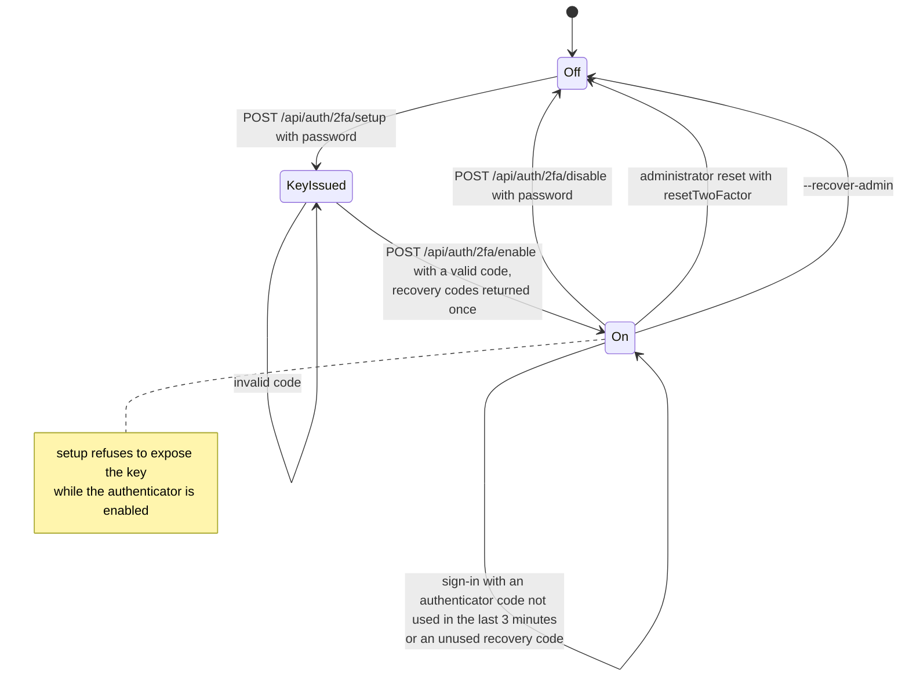

# Two-factor authentication

Back to the [feature walkthrough](README.md). See also [architecture: Authentication](../architecture/authentication.md).

Backend `Auth/TwoFactor`. Setup and disable require the current password, which counts toward the lockout and, when wrong, answers 400 `password.incorrect` like every other re-authentication; setup while the authenticator is on answers 409 `twoFactor.alreadyEnabled` before the password is checked. A wrong code answers 401 `twoFactor.invalidCode`, at sign-in and on enable alike. The endpoints only forward to `IAuthService` (`LoginAsync`, `SetupTwoFactorAsync`, `EnableTwoFactorAsync`, `DisableTwoFactorAsync`), which also renews the session after a change. A wrong code on enable counts toward the same lockout, and setup, enable and disable are each throttled to 5 calls per five minutes per client.

## A code works once

Identity's authenticator provider accepts a code for two 30-second steps on either side of the current one, about two and a half minutes, and does not remember which code it accepted, so a code read over a shoulder or relayed by a phishing page could be used again inside that window. Since 2026-10-01 every place that accepts an authenticator code, sign-in and enable, goes through `AuthenticatorCode.ConsumeAsync` in `Infrastructure/Auth`. After Identity accepts the code it reads the last accepted code of that user from Identity's user-token table (`AspNetUserTokens`, provider `[JxFinance]`, name `LastAuthenticatorCode`, stored as the Unix time and the SHA-256 of the code as a number, so `0123456` and `123456` are the same code) and refuses the same code within three minutes of its use with the usual 401 `twoFactor.invalidCode`, which counts toward the lockout like any wrong code. Otherwise it stores the new code and time. The code that turned two-factor on is therefore not accepted for a sign-in right after; the next code the app shows is. Recovery codes were already single-use through Identity. No migration was needed, the row travels in backups with the authenticator key, and the member export leaves it out with the rest of `AspNetUserTokens`. Two sign-ins racing with the same code in the same instant can both pass, because the check and the write are not one statement.

## Passkeys and the code step

[Passkeys](passkeys.md) are independent of the authenticator. A user-verified passkey is a whole sign-in, so a member with two-factor authentication on who signs in with a passkey is not asked for a code, and the code step of a password sign-in offers "Use a passkey instead", which runs the same passkey sign-in. Recovery codes stay the fallback for the authenticator only; passkeys have none of their own. The administrator's reset with `resetTwoFactor` and `--recover-admin` switch the authenticator off and remove the passkeys together, because a lost phone usually takes both. On Settings › Personal › Security the two-factor section comes first and the Passkeys section under it; both confirm the password with the same `PasswordPrompt`.
