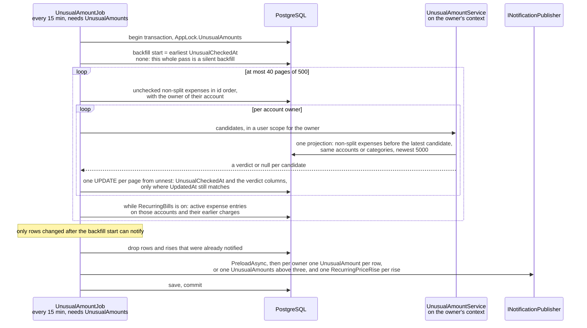

# Unusual amounts

Back to the [feature walkthrough](README.md). See also [decisions](../decisions/unusual-amounts.md).

Backend `Common/Unusual` (`UnusualAmountRule`, `UnusualAmountService`, `PriceRiseRule`, `PriceRiseMatcher`), the scan in `Infrastructure/BackgroundJobs/UnusualAmountJob`, the routes in `Transactions/DismissUnusualAmount` and `Transactions/RestoreUnusualAmount`, and the unusual parts of `Transactions`, `Imports` and `RecurringBills`. Frontend: the badge in `components/unusual-amount-badge`, the "Unusual only" filter of the ledger, the "Unusual amount" mark in `imports`, the "Matches bank text" field and the price-rise line in `recurring-bills`, and three kinds in the notification bell.

An expense far above what its payee or its category usually costs gets a small rising-arrow badge in the ledger, on the dashboard's recent transactions and in the import preview, with a sentence such as "3.1× the usual €41.50 for this payee". A newly flagged row raises a notification, the ledger can show unusual rows only, and a row can be marked "Not unusual" so it stays quiet. The same pass watches subscriptions: when a bank charge that pays a recurring entry costs more than the entry expects, the recurring entries page says so, a notification is raised, and for a fixed entry one button updates the expected amount.

It is a feature switch, `Feature.UnusualAmounts`, on by default (`HasDefaultValue(true)` on the column `Features_UnusualAmounts`), because it runs a job and raises notifications and an installation should be able to stop both. It gates two routes; everything else it adds is fields on existing requests and responses, which read as empty while it is off.

## The rule

`UnusualAmountRule` is a pure static class that holds every constant and decides from a list of numbers alone. The median and the spread come from `Common/Statistics.cs`, which [budget limits from history](budgets.md#limits-from-history) and `PriceRiseRule` share. The amounts are `ReportingAmount`, in the reporting currency, so rows in different currencies compare on one scale.

| Constant | Value | Meaning |
| --- | --- | --- |
| `LookBackMonths` | 12 | The history is the non-split expenses dated in the 12 months before the row's date, strictly before it |
| `PayeeMinimumHistory` | 4 | Earlier rows the payee baseline needs |
| `CategoryMinimumHistory` | 8 | Earlier rows the category baseline needs |
| `MinimumFactor` | 2 | The amount must be at least twice the median |
| `SpreadMultiple` | 4 | The amount must be at least the median plus four spreads |
| `MinimumExcess` | 10 | The amount must be at least 10 reporting units above the median |
| `Statistics.MadScale` | 1.4826 | The spread (`Statistics.Spread`) is the median absolute deviation times this, which makes it comparable to a standard deviation |

A row is flagged when all three conditions hold: `amount ≥ 2 × median`, `amount ≥ median + 4 × spread` and `amount − median ≥ 10`. With less history than the basis needs, or a median that is not positive, the rule says nothing. The median and the median absolute deviation are used rather than the mean and the standard deviation because they are robust to exactly the outliers the rule is looking for: one earlier spike does not raise the bar for the next one. Each condition covers a case the other two miss. The factor alone would flag a coffee at twice the usual price. The spread alone would flag anything above a perfectly flat history. The floor keeps small amounts quiet.

The result is an `UnusualVerdict(Basis, TypicalAmount, Factor, SampleSize)`: the median rounded to two places, the amount divided by the median rounded to two places, and the number of history rows. The screens show the factor with one decimal.

### The baseline

`UnusualAmountService` picks the baseline per row:

1. **Payee.** The rows on the same account with the same payee key, `SubscriptionDescription.Normalize` of the statement's payee or else the description, the function subscription detection already trusts. With at least 4 earlier rows the payee decides, and its answer is final even when it says the amount is usual. Since 2026-10-01 the history reads the key every transaction stores as `PayeeKey` for [spending by payee](reports.md#expense-by-payee), and `UnusualCandidate` carries a key rather than a description: the job passes the row's stored key and the import preview normalizes the statement row's description, since that row is not saved yet. A candidate with an empty key, such as a description of only reference numbers, goes straight to the category.
2. **Category.** Otherwise the rows of the same category, on any account the account owner can see, with at least 8 earlier rows.
3. Otherwise the row is not flagged. A row with no category and a new payee is never flagged.

"Unusual for this shop" is sharper than "unusual for groceries", which is why the payee comes first.

### A worked example

Six earlier payments at Maxima on one account: 38.00, 40.00, 41.00, 42.00, 44.00 and 45.00. The median is 41.50. The deviations from it are 3.50, 1.50, 0.50, 0.50, 2.50 and 3.50, whose median is 2.00, so the spread is 2.00 × 1.4826 = 2.97. The three bars are 2 × 41.50 = 83.00, 41.50 + 4 × 2.97 = 53.36 and 41.50 + 10 = 51.50, so here the factor is the one that binds. A payment of 130.00 clears all three and is stored as payee basis, typical 41.50, factor 3.13, sample size 6, and the ledger says "3.1× the usual €41.50 for this payee". A payment of 80.00 is 1.9× the median and stays unflagged.

Two other cases show the other bars binding. Four coffees at 2.90 to 3.20 have a median of 3.05, so a 12.00 bill is almost four times the usual and still not flagged, because it is only 8.95 above the median. Eight expenses in a category between 20.00 and 150.00 have a median of 70.00 and a spread of 44.48, so a 200.00 expense is 2.9× the median and still not flagged, because the noisy history puts the spread bar at 247.91.

## Which rows, and as of when

Only expenses that are not split are evaluated, and only such rows count as history, because a split has no per-line reporting amount stored. Income is never flagged: a bonus is rarely a problem to catch. A [refund](transactions.md#refunds), an expense with a negative amount, is neither judged nor counted as history, because it is not a charge and would drag a payee's median down: the job marks it checked with no verdict, an edit that turns a row into a refund clears its verdict, and the price-rise check skips it too. Transfers, currency conversions and investment entries are not transactions and are never looked at. A conversion fee is an ordinary expense transaction and is evaluated like one.

A verdict means "unusual compared with the 12 months before its date, as of when it was recorded or last edited". It is computed once and stored, and later changes to the history do not re-flag or clear old rows, so a flag does not flicker as new rows arrive. Rows imported together are judged against each other, because the job reads the history after they are stored.

`UnusualCheckedAt` null means "not evaluated yet", and that is the only hook the write paths need. `AppDbContext.ApplyEntityRules` calls `Transaction.RecheckUnusual()`, which sets it back to null (and drops the verdict of a row that is now split, not an expense or a refund), when a tracked transaction changes its `Amount`, `AccountId`, `CategoryId`, `Type`, `Date`, `Description` or `IsSplit`; tags, attachments and anything else leave it alone. The three writers that change `CategoryId` with `ExecuteUpdate` go through one `SetCategoryAsync` extension (`Common/TransactionUpdates.cs`), which clears it too: deleting a category, a categorization rule run, and restoring a deleted category from the trash. An edited row keeps its old verdict until the next pass replaces or clears it, which is at most one interval later, except a row that became split or stopped being an expense: the job never looks at those again, so the edit clears their verdict columns at once. Changing the reporting currency clears `UnusualCheckedAt` on every transaction, deleted ones included, so the ledger is judged again with medians and floors in the new currency. With nothing checked any more, the backfill starts again and stays silent until it has caught up, like the very first one, as described under The job below.

## Where the verdict lives

Six nullable columns on `Transactions`:

| Column | What it holds |
| --- | --- |
| `UnusualCheckedAt` | When the job last evaluated the row; null means it is due |
| `UnusualBasis` | `Payee` or `Category`, stored as its name (max 20); null when the row is usual |
| `UnusualTypicalAmount` | The median, numeric(18,2), in the reporting currency |
| `UnusualFactor` | numeric(9,2) |
| `UnusualSampleSize` | The number of history rows |
| `UnusualDismissedAt` | Set by "Not unusual" and kept across edits, so correcting a typo does not bring the flag back |

`TransactionMapper` turns the columns into the `unusual` response through the same `UnusualVerdict.ToResponse()` the import preview uses. A partial index on (`AccountId`, `Date`) where `UnusualBasis` is not null and `UnusualDismissedAt` is null serves the ledger filter, and a partial index on `UnusualCheckedAt` where it is null serves the job.

The four verdict columns are one optional EF complex property, `Transaction.Unusual` of type `UnusualVerdict`, mapped onto the existing column names, so a row either has a whole verdict or none. The job writes a page of verdicts with one `UPDATE "Transactions" … FROM unnest(ids, updatedAts, bases, typicals, factors, samples)` that matches each row's `UpdatedAt` and returns the ids it wrote, so a row edited since the page was read keeps its reset check; the dismissal writes its own column with `ExecuteUpdate`. Neither write moves `UpdatedAt` or passes through the change tracker, so a verdict is not an edit: it does not reset its own check, and it does not reach the household activity log.

## The job

`UnusualAmountJob` is a `PeriodicJob` that runs every 15 minutes with `RequiredFeature = UnusualAmounts`. A pass runs in one transaction holding `AppLock.UnusualAmounts` (`738192441`) from start to end; nothing leaves the server, so there is no reason to split it the way the outbox jobs do.

1. It reads the **backfill start**, the earliest `UnusualCheckedAt` of any transaction, deleted or not. When none has been checked, this pass starts the backfill and all of it is silent: verdicts are stored, nothing is notified and no price is compared. In later passes a row is part of the backfill when its `UpdatedAt` is not after the backfill start, which means it has not been written since the backfill began, and such a row stays silent too. That covers the upgrade, since the migration leaves every row unchecked, and the first import of a new installation, however many passes the backfill takes.
2. It pages 500 unchecked non-split expenses at a time in id order, ignoring the owner filter but not soft deletion, joined to their account for the owner, for at most 40 pages (20,000 rows); the rest wait for the next pass.
3. Per account owner it evaluates the page's rows through `IUnusualAmountService` resolved from a user scope for that owner, so the category history is what that owner can see: their own accounts and the accounts shared into any of their households, without an active household. The service makes one bounded query for all the candidates, the non-split expenses from 12 months before the earliest candidate to the latest one on the candidates' accounts or in their categories, newest 5000 (`MaxHistoryRows`), with their stored `PayeeKey`, groups them in memory by account and payee key and by category, and leaves each candidate out of its own history.
4. It stores the result in one statement per page, which also clears any old verdict of a row that is usual now.
5. While `RecurringBills` is on, it compares the page's charges with the recurring entries, described under Price rises below.

A flagged row is notified only when all of these hold:

- a backfill has started and the row changed after it started (`UpdatedAt` later than the backfill start);
- the row carried no verdict before this check, so an edit that keeps it unusual does not notify twice;
- it is not dismissed;
- it is dated within the last 45 days (`NotifyWithinDays`) of today in the installation time zone;
- no `UnusualAmount` notification about that transaction exists yet.

The notification goes to the account owner, as bills and budgets do, not to every member of a household that shares the account. When one owner has more than three (`SummaryAbove`) such rows in a pass they get a single `UnusualAmounts` notification with the count instead of one per row.

A ledger with more than 20,000 unchecked non-split expenses needs more than one pass to catch up. The rows left for the later passes were written before the backfill started, so they stay silent however many passes it takes, while a row created or edited meanwhile is judged like any other. Every write path that clears `UnusualCheckedAt` for a changed row also moves its `UpdatedAt`, which is what lets an edit notify; the reporting-currency change clears it on every row, so the earliest check is gone and a new silent backfill begins.

## Notifications

Three kinds, appended to `NotificationType`, all written through `INotificationPublisher` in the job's transaction, so they also reach Discord for owners who ticked them. None of them sends an email. The payload gained `transactionId`, `billId`, `amount` and `typicalAmount` (decimal strings with two places), `factor`, `count` and `currency`, and `NotificationRelated.Transaction` names a transaction as the related row.

| Kind | Title | Payload | Related row | Link |
| --- | --- | --- | --- | --- |
| `unusualAmount` | The transaction's description, or "—" | `transactionId`, `amount`, `typicalAmount`, `factor`, `currency` (the reporting currency) | the transaction | `/transactions?unusual=true`, while `UnusualAmounts` is on |
| `unusualAmounts` | Up to three distinct descriptions, then "…" when there were more | `count` | none | `/transactions?unusual=true`, while `UnusualAmounts` is on |
| `recurringPriceRise` | The recurring entry's name | `billId`, `transactionId`, `amount` (charged), `typicalAmount` (expected), `currency` (the account's) | the recurring entry | `/recurring-bills`, while `RecurringBills` is on |

The payload carries the currency so the bell and Discord format each amount in the currency it was computed in; a price rise is in the account's currency, not the reporting currency. Titles are clipped to 200 characters.

| Kind | Bell and Discord, English | Lithuanian |
| --- | --- | --- |
| `unusualAmount` | "{amount}: {factor}× the usual {typical}" | "{amount}: {factor}× daugiau nei įprasta ({typical})" |
| `unusualAmounts` | "{count} expenses are well above their usual amount" | "Neįprastai didelių išlaidų: {count}" |
| `recurringPriceRise` | "Charged {amount}, expected {expected}" | "Nuskaičiuota {amount}, tikėtasi {expected}" |

The bell formats the amounts for the viewer's language; Discord writes them as `249.00 EUR`. `NotificationTexts.PagePath` answers `/transactions?unusual=true` for the first two and `/recurring-bills` for the third, and the profile's Notifications table lists the three kinds with the others. `Message` carries the same sentence in the installation's default language, from `NotificationTexts.Sentence`.

## Price rises

A recurring entry and a bank charge are linked by text, not by a foreign key: imported bank rows are the real charges and never pass through confirmation, and a confirmed fixed entry always writes the expected amount, so it could never show a rise.

- **The entry's keys** are `PriceRiseMatcher.KeysOf(bill)`: `SubscriptionDescription.Normalize` of `RecurringBill.MatchKey` when it is set, of the name otherwise, and always the normalized name as well, so a confirmed occurrence written under the entry's name counts as one of its charges.
- **A charge matches** when it is a non-split expense with a description, on the entry's account, in that account's main currency, and its stored `PayeeKey` (the normalized statement payee, else the description) equals the key. A charge in another currency on the same account is skipped, not converted.
- **Only** active expense-shaped entries with an account are considered.
- **The expected amount** is the entry's `Amount` for a fixed entry, otherwise the median of the earlier matching charges in the 13 months (`PriceRiseRule.LookBackMonths`) before the charge. A variable entry with no earlier charge has nothing to compare.
- **A rise** is `charged > expected × 1.03` and `charged − expected > 0.50` (`MinimumRatio`, `MinimumExcess`), with a positive expected amount.

The job compares, per page, the charges that are not part of the backfill by the same rule, are dated within the last 45 days and carry a description, and raises one `RecurringPriceRise` for the entry's owner per entry and charge. The earlier charges come from `PriceRiseMatcher.LoadChargesAsync` narrowed in SQL to the matched entries' keys, as on the recurring entries page, so other payees on the same accounts no longer count against its 5000-row cap; a charge already named in a rise notification of that entry is skipped. It needs both switches: the job only runs while `UnusualAmounts` is on, and it only compares while `RecurringBills` is on.

`RecurringBill.MatchKey` is filled when an entry is created from a subscription suggestion, because `SubscriptionCandidateResponse.description` is already the normalized key, and it can be edited as "Matches bank text" in the form, shown for every shape since the [cash-flow forecast](cash-flow-forecast.md) estimates variable income and transfers from it, with the hint that an empty field matches the name. The server normalizes it again on save, stores null for an empty result and refuses more than 200 characters. Subscription detection now checks coverage through the same `KeyOf`, so a suggestion turned into an entry stays covered after the entry is renamed. Detection's 15% amount tolerance still absorbs a rise into the same group; this is the separate check that reports it.

### On the recurring entries page

`GET /api/recurring-bills` answers `matchKey` and `latestMatch` on each entry: `date`, `amount` in the account's currency, a nullable `expected` and `isPriceRise`. It is computed only while `UnusualAmounts` is on, with one query over the listed entries' accounts for the last 13 months, narrowed in SQL to rows whose stored `PayeeKey` is one of the entries' keys, newest first, at most 5000 rows; the latest matching charge is compared with the ones before it by the same rule. The single-entry answers (get, create, update and confirm) fill it the same way for their one entry.

When `isPriceRise` is true the row adds a line with the rising arrow, "Charged €27.99 on 3 Sep, expected €24.99". A fixed entry also gets "Update expected amount", which sends the ordinary `PUT /api/recurring-bills/{id}` with the entry unchanged except the amount, set to the charge; there is no new write path. A variable entry shows the line without the button, because its expected amount is the median of its own history.

## In the ledger

`TransactionResponse` gained `unusual` (`basis`, `typicalAmount` in the reporting currency, `factor`, `sampleSize`), null when the row is usual, and `unusualDismissed`, true only for a flagged row that was marked "Not unusual".

`UnusualAmountBadge` sits beside the paperclip in the table's description cell, in the phone list and in the dashboard's recent transactions. It renders nothing while the feature is off or the row has no verdict. It is a button showing a lucide `TrendingUp` icon whose accessible name and title are the sentence, "{factor}× the usual {typical} for this payee" or "… in this category", with "Marked as not unusual." added when it is dismissed, so the meaning is carried by text and not by colour; a dismissed badge is muted. The button opens a popover with the sentence and one action:

- **Not unusual** posts the dismissal, closes the popover and shows a toast with Undo, which deletes it again.
- **Mark as unusual again** deletes the dismissal and confirms with a toast.

The actions live in the badge because that is where the reason is shown; the row menu stays as it was. Both mutations refresh the transaction list and summary.

`unusual=true` keeps the rows that are flagged and not dismissed. It is on `TransactionFilterRequest`, which the list, the summary and both exports share through `Filtered`, so the rows, the totals line, the CSV and the PDF agree; it is ignored while the feature is off. On the table the amount column's filter becomes a small form with the income or expense select and an "Unusual only" checkbox while the feature is on; the phone filters dialog has the same checkbox. The value is the `unusual` search param, counts as an active filter, travels in the export links and in a saved filter, and a saved filter written before it parses without it. The two unusual notification kinds open the ledger with it set.

## In the import preview

`ImportPreviewRow` gained `unusual` in the same shape. While the feature is on, `ImportPreviewService.PreviewAsync` makes, for either statement format, one batch call to `IUnusualAmountService.EvaluateAsync` over the expense rows, valued through `ITransactionValuation` at the rate for each row's date; a row that cannot be valued gets no verdict. The category a row is judged in is the one its categorization rule suggests, because the client's recall of the latest matching description happens after the preview is answered. The call runs as the caller through the request's context, so a narrowed household scope narrows the category history too.

Nothing is stored. Confirmed rows arrive unchecked and the job evaluates them, so the stored flag has one source; for a payee baseline the two agree, which a test asserts. The screen shows an "Unusual amount" mark with the sentence in its tooltip among the marks under the row's description, never on a duplicate row, since that one cannot be imported.

## Endpoints

| Route | What it does |
| --- | --- |
| `POST /api/transactions/{id}/unusual/dismiss` | Sets `UnusualDismissedAt` to now and answers 204; 404 `resource.notFound` when the transaction is not visible, 404 `feature.disabled` while the feature is off |
| `DELETE /api/transactions/{id}/unusual/dismiss` | Clears it and answers 204, with the same 404s |
| `GET /api/transactions`, `/summary`, `/export`, `/export/pdf` | Take `unusual` |
| `GET /api/transactions`, `GET /api/transactions/{id}` | Answer `unusual` and `unusualDismissed` |
| `POST /api/import/preview` | Answers `unusual` on each row |
| `GET /api/recurring-bills`, `GET /api/recurring-bills/{id}`, create, update and confirm | Answer `matchKey` and `latestMatch` |
| `POST` and `PUT /api/recurring-bills` | Take `matchKey` |

The two routes sit in `TransactionsGroup`, which belongs to no feature, and each declares `RequiresFeature(Feature.UnusualAmounts)` on itself through `Options`. `FeatureGateTests` lists `/api/transactions/{id}/unusual` as a gated prefix, and the longest matching prefix now decides, so the rest of `/api/transactions` stays ungated. The dismissal is a mark on the transaction, not a per-user preference: anyone who can see the row can set or clear it. There are no new error codes.

## Switching it off

- The job does not run. Rows written meanwhile stay unchecked and are evaluated, and may be notified, on the first pass after it is switched back on.
- The list and the single-transaction read answer `unusual` null and `unusualDismissed` false; the stored columns are kept, so switching back on shows them again.
- `unusual=true` is ignored, the two routes answer `feature.disabled`, the preview carries no verdicts and the recurring entries carry no `latestMatch`.
- The badge and the filter checkbox disappear on the client, and the unusual notifications already raised stay listed but lose their link, like every other kind whose feature is off.

## Backup and restore

The new columns belong to `Transactions`, `RecurringBills` and `InstanceSettings` and travel with them; nothing is transient. A restored installation keeps its verdicts and check times, so it does not backfill again. See [Backup and restore](backup-and-restore.md).

## Tuning

The constants are the ones the plan chose. The plan's last step, running the job over `just seed` demo data and a copy of a real ledger, counting the flags per month and adjusting the three constants until a normal month shows a handful rather than dozens, has not been done yet; it is listed as an open question in the [decision log](../decisions/unusual-amounts.md).

## Tests

`StatisticsTests` cover the median of an even count and the spread. `UnusualAmountRuleTests` are the unit tests: too little history, three times the usual amount with its factor, a flat history, a noisy history, the 10-unit floor at its boundary, a median that is zero or negative, the price-rise boundaries at 3% and 0.50, and the median a variable entry expects. `PayeeKeyQueryTests` capture the SQL without a database and check that the history, the price-rise charges and subscription detection read the stored `PayeeKey` and never the description. `UnusualAmountTests` covers a payee baseline, a category baseline when the payee is new, too little history, income, split rows and transfers never flagged, an edit back to normal clearing the flag while a dismissal survives, a tag change asking for no new check, a silent backfill, a row left over from the backfill staying silent in a later pass, more than three flags making one summary and a second run notifying nothing, a single flag, the ledger filter with paging, a household partner seeing the flag on a shared account, the preview agreeing with the job, and the feature switched off. `PriceRiseTests` covers a fixed entry matched through its bank text, a variable entry matched through its name, a charge at the expected amount and a charge in another currency. `FeatureGateTests` knows the new gated prefix and `NotificationTextsTests` fails for a kind without text. The badge, the recurring entry row and the bell have stories for each state.
