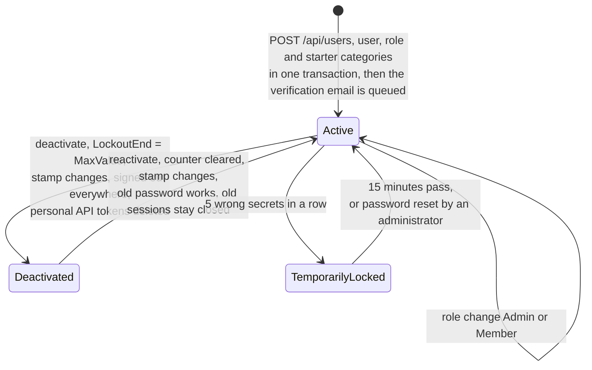
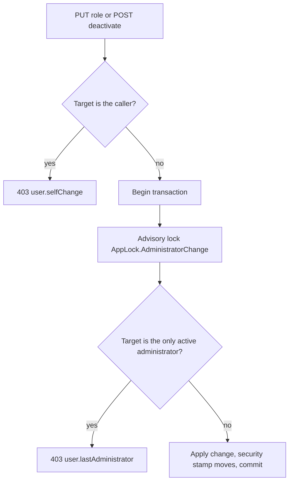
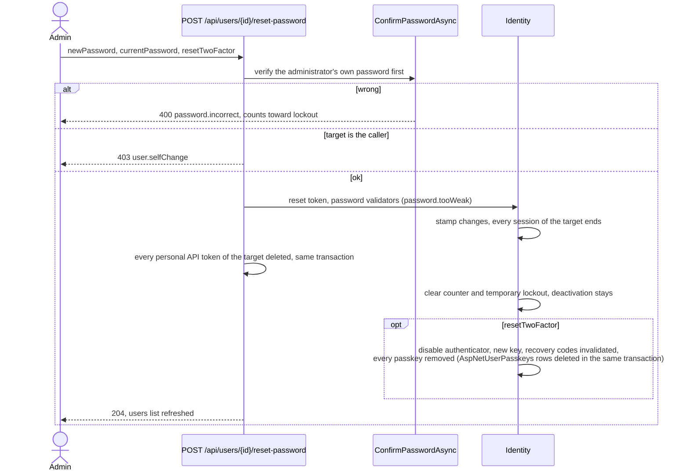

# User management

Back to the [feature walkthrough](README.md). See also [decisions](../decisions/user-management.md).

Backend `Users`, Admin role only, page `/users`, listed as Users under Installation on the one Settings page (see [Installation settings](installation-settings.md#one-settings-page)); its title and a small outline "Create user" button sit in a section header inside that layout. There is no public registration.

A created user starts with an unconfirmed address and, when the installation has a mail server, one queued confirmation link. Nothing waits for it: the account is usable at once, and an unconfirmed address blocks only unsolicited mail to that address. The administrator's password reset below stays the primary way back in; a user with a working mailbox can now also reset their own password from the sign-in screen. See [Email](email.md).

Deactivation and a password reset, by an administrator or through the emailed link, also delete every [personal API token](personal-api-tokens.md) of the member, in the transaction that makes the change, because either means someone else may be in the account. Reactivation brings none back; the member creates new ones. An own password change keeps them.

## Listing users

`GET /api/users` used to load every user and then ask Identity for each one's roles, so a hundred users cost a hundred and one queries, and the role and status filters were applied to the materialized list afterwards. The role now comes back with the user, as an `IsAdmin` flag computed from `AspNetUserRoles` and `AspNetRoles` in the same statement, and both filters are `WHERE` clauses: a deactivated user is one whose `LockoutEnd` reaches the deactivation sentinel, and a role that is neither `Admin` nor `Member` matches nobody and answers an empty list without asking the database at all. Sorting by name, email, role or status still happens in memory over the answered page, because role and status are computed values and the sort has to be stable on the email order the query returns.

The filters live in the URL (`search`, `role`, `isActive`, `sort`, `direction`) and `useUserFilters` in `features/users/users-table/user-filters.tsx` reads and writes them for both layouts. From the `md` breakpoint they sit in the table's column headers beside the sort buttons; below it the list has no headers, so a "Filters" bar above the rows offers a search field, a role select and a status select. The phone layout has no sort control and lists users in the order the URL asks for, by name when it asks for none. The role change, deactivation behind its confirmation, reactivation and the password reset dialog are owned by `useUserRowControls` beside the table, which both layouts share.

## Last administrator guard

## Password reset by an administrator

